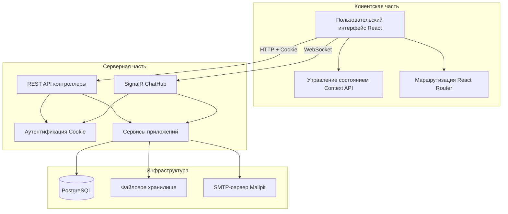
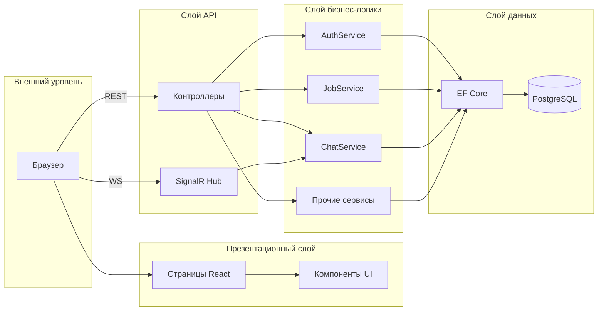
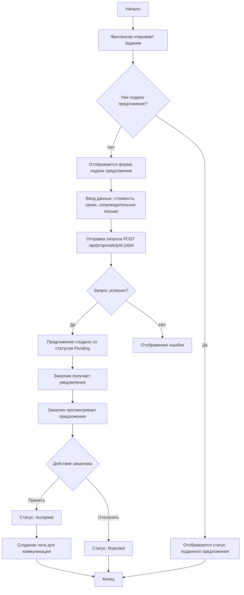
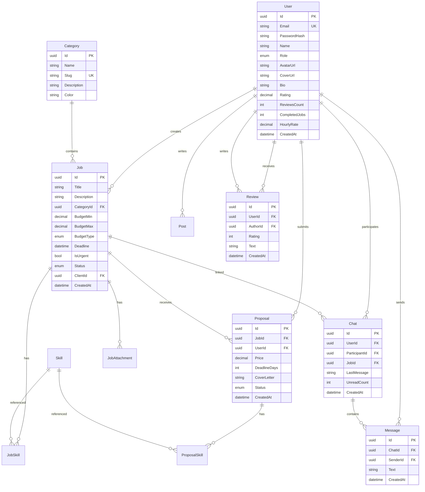
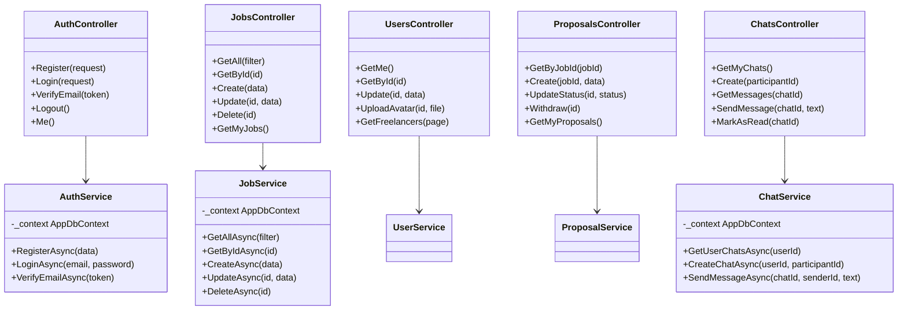

# Пояснительная записка дипломного проекта

## Введение

В современном мире цифровизация затронула практически все сферы деятельности человека. Рынок фриланс-услуг стремительно растёт: по данным платформы Upwork, количество удалённых специалистов увеличилось на 24% за последние несколько лет [7]. При этом на российском рынке наблюдается дефицит удобных, локализованных платформ для поиска фрилансеров и размещения заказов. Существующие решения либо ориентированы на международную аудиторию и не учитывают специфику российского рынка, либо имеют устаревший интерфейс и ограниченный функционал.

Актуальность темы обусловлена необходимостью создания современной, доступной и удобной информационной системы, позволяющей заказчикам находить квалифицированных исполнителей, а фрилансерам — предлагать свои услуги и вести коммуникацию в единой среде.

Цель дипломного проекта — разработка веб-приложения SYNQ — маркетплейса фриланс-услуг, обеспечивающего полный цикл взаимодействия между заказчиками и исполнителями: от поиска и размещения заданий до обмена сообщениями и оставления отзывов.

Для достижения поставленной цели были сформулированы следующие задачи:

1. Провести анализ предметной области и существующих аналогов;
2. Сформулировать функциональные и нефункциональные требования к системе;
3. Обосновать выбор стека технологий;
4. Спроектировать архитектуру приложения, базу данных и пользовательские интерфейсы;
5. Реализовать серверную часть на платформе ASP.NET Core;
6. Реализовать клиентскую часть на базе React;
7. Разработать мероприятия по обеспечению информационной безопасности;
8. Провести тестирование разработанной системы.

## 1 Анализ предметной области

### 1.1 Описание предметной области

Предметной областью проекта является рынок фриланс-услуг. Фриланс-маркетплейс представляет собой электронную платформу, которая объединяет две основные группы пользователей: заказчиков (клиентов), размещающих задания, и исполнителей (фрилансеров), предлагающих свои услуги для выполнения этих заданий.

Процесс взаимодействия на фриланс-маркетплейсе включает следующие этапы:

1. Регистрация пользователя в системе с указанием роли (заказчик или фрилансер);
2. Создание заказчиком задания с указанием категории, бюджета, срока выполнения и требуемых навыков;
3. Просмотр доступных заданий фрилансерами и подача заявок (предложений) с указанием стоимости, сроков и сопроводительного письма;
4. Выбор заказчиком подходящего исполнителя из числа подавших заявки;
5. Обмен сообщениями между заказчиком и исполнителем для уточнения деталей;
6. Завершение работы и оставление отзывов с оценкой.

Ключевые сущности предметной области включают: пользователи, категории услуг, задания, предложения, чаты, сообщения, публикации и отзывы.

### 1.2 Обзор аналогов

Для выявления достоинств и недостатков существующих решений были проанализированы следующие фриланс-платформы.

**FL.ru** — крупнейшая российская фриланс-биржа. Предлагает широкий спектр категорий услуг, систему безопасной сделки, рейтинги исполнителей. Однако платформа имеет перегруженный интерфейс, большое количество рекламы и платные тарифы для полноценного использования функций [8].

**Kwork.ru** — российский магазин услуг с фиксированными ценами. Отличается простотой публикации услуг и быстрой работой, но ограничивает фрилансеров фиксированной стоимостью и не даёт возможности вести гибкую коммуникацию по каждому заданию [9].

**Upwork** — международная платформа с расширенным функционалом, включая трекер времени, escrow-платежи, видеозвонки. Однако высокая комиссия (до 20%), сложная система оплаты и отсутствие локализации для российского рынка существенно ограничивают удобство использования для отечественных пользователей [10].

**Fiverr** — международная платформа с моделью «магазин услуг». Фрилансеры создают пакеты услуг с фиксированной ценой. Платформа имеет привлекательный дизайн и качественную систему отзывов, но ограничивает гибкость ценообразования и коммуникацию между сторонами [11].

Анализ аналогов показывает, что ни одна из существующих платформ не сочетает в себе современный интерфейс, локализацию на русский язык, гибкую систему обмена сообщениями и отсутствие высоких комиссий. Это подтверждает актуальность разработки собственного решения.

### 1.3 Требования к разрабатываемой ИС

#### Функциональные требования

1. Регистрация и авторизация пользователей с разделением на роли (заказчик, фрилансер);
2. Создание, редактирование и удаление заданий заказчиками;
3. Просмотр каталога заданий с возможностью фильтрации по категориям, бюджету и поиску;
4. Подача предложений на задания фрилансерами;
5. Принятие или отклонение предложений заказчиками;
6. Обмен сообщениями между пользователями в реальном времени;
7. Просмотр и редактирование профиля пользователя;
8. Загрузка и отображение аватара и обложки профиля;
9. Система публикаций (постов) в профиле фрилансера;
10. Система отзывов и рейтингов;
11. Категоризация заданий по направлениям;
12. Управление собственными заданиями и предложениями.

#### Требования к интерфейсу

1. Доступность на различных устройствах (мобильные телефоны, планшеты, ПК) — адаптивная вёрстка;
2. Пользовательский опыт: простота навигации, минимализм дизайна;
3. Адаптивность интерфейса в зависимости от разрешения экрана;
4. Единый визуальный стиль на всех страницах приложения (glassmorphism-дизайн, анимации переходов);
5. Локализация интерфейса на русский язык.

### 1.4 Обоснование выбора стека технологий

#### Языки программирования

**C#** выбран для реализации серверной части. Преимущества: строгая типизация, богатая экосистема библиотек .NET, высокая производительность, кроссплатформенность благодаря .NET 8. По сравнению с Python, C# обеспечивает лучшую производительность для веб-приложений; по сравнению с Java — более лаконичный синтаксис и современная система асинхронного программирования [3].

**JavaScript** выбран для реализации клиентской части. Язык является стандартом де-факто для веб-разработки, обеспечивает нативную поддержку в браузерах и обладает широчайшей экосистемой библиотек. По сравнению с TypeScript, чистый JavaScript упрощает процесс разработки и снижает порог входа для данного проекта [4].

#### Фреймворки

**ASP.NET Core 8** — фреймворк для серверной части. Обеспечивает высокую производительность (один из самых быстрых веб-фреймворков по бенчмаркам TechEmpower), встроенную поддержку dependency injection, модульную архитектуру и встроенную систему аутентификации [1].

**React 18** — библиотека для построения пользовательского интерфейса. Обеспечивает компонентный подход, виртуальный DOM для эффективного обновления, богатую экосистему и высокую производительность. По сравнению с Vue.js, React имеет более широкое сообщество и больше доступных компонентов; по сравнению с Angular — меньший порог входа и более гибкая архитектура [5].

#### Система управления базами данных

**PostgreSQL** выбрана в качестве СУБД. Преимущества: открытое программное обеспечение, поддержка сложных типов данных, надёжность и соответствие ACID, расширяемость. По сравнению с MySQL, PostgreSQL предоставляет более мощную систему индексов (включая GIN-индексы для полнотекстового поиска) и лучшую поддержку стандартов SQL. По сравнению с SQLite, PostgreSQL обеспечивает масштабируемость и поддержку конкурентных подключений, необходимых для многопользовательского приложения [2].

#### Дополнительные технологии

- **Vite** — быстрый сборщик клиентского приложения, обеспечивающий мгновенную перезагрузку модулей (HMR) и оптимизированную сборку для продакшена;
- **TailwindCSS** — утилитарный CSS-фреймворк, позволяющий быстро создавать адаптивные интерфейсы без написания кастомных стилей;
- **SignalR** — библиотека для организации реального времени (WebSockets), используемая для обмена сообщениями в чате;
- **Entity Framework Core** — ORM-фреймворк для работы с PostgreSQL, обеспечивающий миграции и LINQ-запросы;
- **Framer Motion** — библиотека анимаций для React, обеспечивающая плавные переходы между страницами и интерактивные эффекты;
- **Axios** — HTTP-клиент для выполнения запросов к серверному API;
- **Docker** — контейнеризация для развёртывания всех компонентов системы (PostgreSQL, .NET backend, React frontend, Mailpit).

## 2 Проектирование

### 2.1 Проектирование системы

#### Определение группы пользователей

Система предусматривает две основные группы пользователей:

1. **Заказчик (Client)** — пользователь, размещающий задания. Функции: создание и редактирование заданий, просмотр предложений, принятие или отклонение предложений, обмен сообщениями, оставление отзывов, управление собственными заданиями;
2. **Фрилансер (Freelancer)** — пользователь, предлагающий услуги. Функции: поиск и просмотр заданий, подача предложений, отмена предложений, обмен сообщениями, ведение публикаций в профиле, управление собственными предложениями.

```mermaid
usecase
  actor Заказчик
  actor Фрилансер

  Заказчик --> (Регистрация/Авторизация)
  Фрилансер --> (Регистрация/Авторизация)
  Заказчик --> (Создание задания)
  Заказчик --> (Редактирование задания)
  Заказчик --> (Удаление задания)
  Заказчик --> (Просмотр предложений)
  Заказчик --> (Принятие/отклонение предложения)
  Заказчик --> (Обмен сообщениями)
  Заказчик --> (Оставление отзыва)
  Фрилансер --> (Поиск заданий)
  Фрилансер --> (Подача предложения)
  Фрилансер --> (Отзыв предложения)
  Фрилансер --> (Обмен сообщениями)
  Фрилансер --> (Ведение публикаций)
  Фрилансер --> (Редактирование профиля)
```

Рисунок 1 — Диаграмма прецедентовusecase

#### Функциональное моделирование

Архитектура приложения построена по принципу клиент-серверного взаимодействия. Клиентская часть (React SPA) взаимодействует с серверной частью (ASP.NET Core WebAPI) через REST API, а для обмена сообщениями в реальном времени используется SignalR WebSocket.



Рисунок 2 — Диаграмма взаимодействия компонентов системы



Рисунок 3 — Многоуровневая архитектура приложения

#### Алгоритм обработки предложения



Рисунок 4 — Блок-схема алгоритма обработки предложения

### 2.2 Разработка модели базы данных

База данных приложения содержит 14 таблиц, организованных в реляционную модель. Основные сущности и связи между ними представлены на диаграмме.



Рисунок 5 — Диаграмма базы данных

Основные ограничения целостности:

- Уникальный индекс по полю Email таблицы Users;
- Уникальный индекс по полю Slug таблицы Categories;
- Каскадное удаление для зависимых сущностей (предложения при удалении задания, сообщения при удалении чата);
- Ограничение на удаление (Restrict) для ссылок на пользователей — нельзя удалить пользователя, если на него ссылаются другие записи;
- Составные первичные ключи для таблиц связей many-to-many (JobSkill, ProposalSkill).

### 2.3 Проектирование интерфейсов

Проектирование интерфейсов выполнено с применением glassmorphism-стиля — современного подхода к визуальному дизайну, при котором элементы интерфейса выглядят как полупрозрачные стеклянные панели с размытием фона (backdrop-blur). Основные принципы дизайна:

- цветовая палитра: тёмная тема с акцентным фиолетовым цветом (primary);
- типографика: шрифт Inter, обеспечивающий высокую читаемость на экранах;
- анимации: плавные переходы между страницами с использованием Framer Motion;
- адаптивность: интерфейс адаптируется к размерам экрана от мобильных устройств до десктопов;
- карточный макет: задания и предложения представлены в виде карточек с masonry-раскладкой;
- модальные окна: для детального просмотра заданий и форм ввода.

Макеты ключевых экранов интерфейса:

1. Главная страница — герой-секция с поиском, каталог категорий, последние задания;
2. Страница регистрации/авторизации — форма с переключением вкладок;
3. Каталог заданий — фильтры, поиск, карточки заданий;
4. Профиль пользователя — аватар, обложка, статистика, публикации;
5. Страница чата — список чатов и область сообщений в реальном времени;
6. Страница создания задания — многосекционная форма.

[ЗАМЕЧАНИЕ: Здесь следует вставить макеты/скриншоты интерфейса приложения]

## 3 Реализация

### 3.1 Реализация основных функций

#### Диаграмма классов серверной части



Рисунок 6 — Диаграмма классов серверной части приложения

#### Реализация аутентификации и авторизации

Аутентификация реализована на основе Cookie Authentication в ASP.NET Core. При регистрации пользователь указывает email, пароль и роль (заказчик или фрилансер). Пароль хешируется с использованием алгоритма PBKDF2 с SHA-256, 100000 итераций, 16-байтовым salt и 32-байтовым ключом.

При успешной аутентификации сервер устанавливает HttpOnly cookie с именем «synq_session» со сроком действия 7 дней и滑动ным обновлением (sliding expiration). Cookie содержит claims: идентификатор пользователя, email, имя и роль.

На клиентской стороне используется axios HTTP-клиент с параметром `withCredentials: true` для автоматической отправки cookie при каждом запросе. Контекст приложения (AppContext) хранит состояние аутентификации и информацию о текущем пользователе.

#### Реализация обмена сообщениями

Обмен сообщениями реализован с использованием SignalR — библиотеки для реального времени от Microsoft. На сервере определён ChatHub, доступный по маршруту `/chatHub` и защищённый атрибутом `[Authorize]`.

ChatHub отслеживает подключения пользователей через статический словарь `_userConnections` и обеспечивает следующие операции:

1. `SendMessage` — отправка сообщения с сохранением в базу данных и уведомлением получателя в реальном времени;
2. `MarkAsRead` — отметка сообщений как прочитанных;
3. `Typing` — индикация набора текста собеседником.

#### Реализация REST API

Серверная часть предоставляет 8 контроллеров с REST-эндпоинтами, покрывающими все функциональные требования:

- `AuthController` — регистрация, вход, выход, верификация email;
- `JobsController` — CRUD-операции с заданиями, фильтрация и пагинация;
- `UsersController` — управление профилем, загрузка аватара и обложки;
- `ProposalsController` — создание предложений, изменение статуса, отзыв;
- `ChatsController` — создание чатов, отправка сообщений, отметка прочитанных;
- `CategoriesController` — получение списка категорий;
- `PostsController` — CRUD публикаций в профиле;
- `ReviewsController` — создание и получение отзывов.

Все контроллеры наследуются от `BaseController`, предоставляющего вспомогательные методы: `GetCurrentUserId()` для извлечения идентификатора текущего пользователя из claims и `OkPaginated()` для формирования ответов с пагинацией.

### 3.2 Реализация интерфейсов

Клиентская часть реализована как Single Page Application (SPA) на React 18 с использованием Vite в качестве сборщика.

#### Маршрутизация

Маршрутизация реализована с помощью React Router v6. Все маршруты, кроме главной страницы и страницы авторизации, защищены компонентом `ProtectedRoute`, проверяющим состояние аутентификации и перенаправляющим неавторизованных пользователей на страницу входа.

#### Управление состоянием

Глобальное состояние приложения управляется с помощью React Context API и `useReducer`. Единый контекст `AppContext` обеспечивает доступ к следующим данным: текущий пользователь, состояние аутентификации, фильтры заданий, активный чат, модальное окно задания и уведомления. Доступ к контексту осуществляется через кастомный хук `useAppContext()`.

#### API-клиент

Для взаимодействия с сервером используется axios-клиент, сконфигурированный с базовым URL `/api` и параметром `withCredentials: true`. API разделён на доменные модули: `auth`, `jobs`, `categories`, `users`, `proposals`, `posts`, `reviews`, `chats`, `signalr`. Ответы сервера нормализуются через функции в `src/utils/normalize.js` перед отображением в компонентах.

#### Компоненты интерфейса

Переиспользуемые компоненты разделены на три категории:

1. **Компоненты общего назначения** (src/components/common/) — Button, Input, Card, Badge, Avatar, Modal;
2. **Компоненты layout** (src/components/layout/) — Header, Footer;
3. **Компоненты предметной области** (src/components/features/) — JobCard, JobModal, ProposalCard, ChatMessage, PostCard.

Каждый компонент поддерживает анимации через Framer Motion и адаптируется к размеру экрана с помощью TailwindCSS.

### 3.3 Тестирование

Тестирование разрабатываемой системы проводилось вручную, поскольку инфраструктура автоматизированного тестирования в проекте не предусмотрена. Основные направления тестирования:

1. **Функциональное тестирование** — проверка всех пользовательских сценариев: регистрация, авторизация, создание задания, подача предложения, обмен сообщениями, редактирование профиля;
2. **Тестирование API** — проверка всех REST-эндпоинтов через Swagger UI и прямые HTTP-запросы;
3. **Кроссбраузерное тестирование** — проверка корректной работы в браузерах Chrome, Firefox, Edge;
4. **Адаптивное тестирование** — проверка корректного отображения интерфейса на различных размерах экрана (мобильные устройства, планшеты, десктопы);
5. **Тестирование безопасности** — проверка доступа к защищённым маршрутам без аутентификации, проверка валидации входных данных.

Для развёртывания тестовой среды используется Docker Compose, включающий PostgreSQL, .NET backend, React frontend и Mailpit для тестирования email-отправки.

## 4 Руководство администратора/пользователя

### 4.1 Описание установки

Для установки и запуска приложения необходимо выполнить следующие шаги:

1. Убедиться, что на компьютере установлен Docker и Docker Compose;
2. Клонировать репозиторий проекта;
3. В корневой директории проекта выполнить команду:

```
docker-compose up -d
```

4. Дождаться загрузки и запуска всех контейнеров (PostgreSQL, backend, frontend, Mailpit);
5. При первом запуске автоматически выполнятся миграции базы данных и заполнение начальными данными (тестовые пользователи и категории).

После запуска сервисы доступны по адресам:

- Фронтенд: http://localhost:3000;
- Бэкенд API: http://localhost:5000;
- Swagger UI: http://localhost:5000/swagger;
- Mailpit (тестовая почта): http://localhost:8025;
- PostgreSQL: localhost:5438.

### 4.2 Описание запуска

После успешной установки все сервисы запускаются автоматически. Для доступа к приложению необходимо открыть браузер и перейти по адресу http://localhost:3000.

Тестовые учётные данные, создаваемые при инициализации:

- Заказчик: email `client@synq.app`, пароль `password123`;
- Фрилансер: email `freelancer@synq.app`, пароль `password123`.

### 4.3 Инструкции по работе

**Для заказчика:**

1. Зарегистрируйтесь с ролью «Заказчик» или войдите под тестовой учётной записью;
2. Нажмите «Создать задание» на главной странице или в навигации;
3. Заполните форму: название, категория, описание, бюджет, срок, навыки;
4. Перейдите в раздел «Мои задания» для управления созданными заданиями;
5. Откройте задание для просмотра поступивших предложений;
6. Примите или отклоните предложение;
7. Используйте чат для коммуникации с исполнителем;
8. Оставьте отзыв после завершения работы.

**Для фрилансера:**

1. Зарегистрируйтесь с ролью «Фрилансер» или войдите под тестовой учётной записью;
2. Просматривайте каталог заданий с фильтрацией по категории и бюджету;
3. Откройте задание и подайте предложение с указанием стоимости, сроков и сопроводительного письма;
4. Перейдите в раздел «Мои предложения» для отслеживания статуса;
5. Заполните профиль: добавьте аватар, обложку, описание, опыт, портфолио;
6. Создавайте публикации в профиле для привлечения заказчиков;
7. Используйте чат для коммуникации с заказчиком.

### 4.4 Сообщения пользователю

При работе с приложением пользователь может столкнуться со следующими ситуациями:

- Если при регистрации указан уже существующий email, система выведет сообщение об ошибке;
- Если пароль не соответствует требованиям (минимум 6 символов), отобразится предупреждение;
- При попытке доступа к защищённым страницам без авторизации пользователь будет перенаправлен на страницу входа;
- При нарушении прав доступа (например, попытка редактирования чужого задания) сервер вернёт ошибку 403.

## 5 Мероприятия по информационной безопасности

### 5.1 Возможные угрозы информационной безопасности

При работе с приложением SYNQ возможны следующие угрозы информационной безопасности:

1. **Несанкционированный доступ к учётным записям** — получение злоумышленником доступа к аккаунту легитимного пользователя путём подбора пароля или перехвата сессии;
2. **Перехват данных при передаче** — возможность чтения и модификации данных между клиентом и сервером при передаче по незащищённому каналу;
3. **Межсайтовый скриптинг (XSS)** — внедрение вредоносного кода в страницы приложения через пользовательский ввод, позволяющее похищать данные пользователей;
4. **SQL-инъекции** — попытка внедрения SQL-кода через входные параметры для несанкционированного доступа к базе данных;
5. **Подделка межсайтовых запросов (CSRF)** — выполнение действий от имени авторизованного пользователя без его согласия;
6. **Утечка данных пользователей** — раскрытие персональных данных, паролей и другой конфиденциальной информации;
7. **Нарушение доступности сервиса** — атаки типа DDoS, приводящие к неработоспособности приложения;
8. **Несанкционированный доступ к API** — обращение к защищённым эндпоинтам без надлежащих прав.

### 5.2 Принятые меры для предотвращения угроз

#### 5.2.1 Разграничение доступа

В приложении SYNQ реализована ролевая модель разграничения доступа. Система предусматривает две роли: «Заказчик» (Client) и «Фрилансер» (Freelancer). Каждая роль имеет определённый набор разрешений.

Таблица 1 — Матрица доступа по ролям

| Функция | Заказчик | Фрилансер | Неавторизованный |
|---------|----------|-----------|-------------------|
| Просмотр каталога заданий | Да | Да | Нет |
| Создание задания | Да | Нет | Нет |
| Подача предложения | Нет | Да | Нет |
| Принятие/отклонение предложения | Да | Нет | Нет |
| Обмен сообщениями | Да | Да | Нет |
| Редактирование профиля | Да | Да | Нет |
| Создание публикации | Нет | Да | Нет |
| Оставление отзыва | Да | Да | Нет |

Разграничение доступа реализовано на нескольких уровнях:

- **На уровне маршрутизации** (клиент) — компонент `ProtectedRoute` проверяет статус аутентификации и перенаправляет неавторизованных пользователей на страницу входа;
- **На уровне API-контроллеров** (сервер) — атрибут `[Authorize]` ограничивает доступ к защищённым эндпоинтам только для аутентифицированных пользователей;
- **На уровне бизнес-логики** (сервер) — проверка прав владения: пользователь может редактировать/удалять только собственные задания, предложения и профили.

Выбор ролевой модели разграничения доступа обусловлен спецификой предметной области — фриланс-маркетплейс чётко разделяется на две категории пользователей с различными функциональными потребностями. По сравнению с дискреционной моделью, ролевая модель проще в управлении и масштабировании, а также не требует сложной системы назначения прав на отдельные объекты [6].

#### 5.2.2 Безопасная идентификация, аутентификация и авторизация

Идентификация пользователей осуществляется по уникальному электронному адресу (email). Каждый пользователь в системе имеет уникальный email, что гарантируется уникальным индексом в базе данных.

Аутентификация реализована с использованием Cookie Authentication в ASP.NET Core. Данный механизм был выбран по следующим причинам:

- **Безопасность cookie** — используется HttpOnly cookie, что исключает доступ к токену сессии через JavaScript и защищает от XSS-атак. По сравнению с хранением JWT-токена в localStorage, HttpOnly cookie не доступен для вредоносных скриптов;
- **Автоматическое управление сессией** — браузер автоматически отправляет cookie с каждым запросом, что упрощает клиентскую логику и снижает вероятность ошибок при работе с токенами;
- **Sliding expiration** — при каждом запросе срок действия cookie продлевается (7 дней), обеспечивая удобство для пользователя без необходимости повторной авторизации;
- **SameSite=Lax** — защита от CSRF-атак, так как cookie не отправляется при кросс-сайтовых POST-запросах.

Хеширование паролей реализовано с использованием алгоритма PBKDF2 с параметрами: SHA-256, 100 000 итераций, 16-байтовый salt, 32-байтовый ключ. Данный алгоритм выбран по следующим причинам:

- PBKDF2 является стандартом (RFC 8018) и рекомендован NIST для хеширования паролей;
- Высокое количество итераций (100 000) делает атаку перебором (brute force) вычислительно затратной;
- Использование случайного salt для каждого пароля предотвращает атаки по радужным таблицам (rainbow tables);
- По сравнению с bcrypt, PBKDF2 с SHA-256 имеет встроенную поддержку в .NET без дополнительных зависимостей;
- По сравнению с простыми хеш-функциями (MD5, SHA-1), PBKDF2 устойчив к атакам перебором благодаря механизму ключевого расширения.

Авторизация реализована на основе claims, embedded в аутентификационный cookie. Claims включают: идентификатор пользователя (NameIdentifier), email, имя и роль. При каждом запросе middleware ASP.NET Core автоматически извлекает claims из cookie и создаёт объект `ClaimsPrincipal`, используемый контроллерами для проверки прав доступа.

Для верификации email-адреса генерируется криптографически случайный токен (64 байта, закодированный в base64url) с ограничением срока действия 24 часа. Это предотвращает регистрацию с несуществующими email-адресами.

#### 5.2.3 Безопасное хранение данных и резервное копирование

Безопасное хранение данных пользователей обеспечивает несколько механизмов:

1. **Хеширование паролей** — пароли хранятся исключительно в хешированном виде. Формат хранения: `{hex_salt}:{hex_hash}:{iterations}`. Процедура верификации пароля извлекает salt и количество итераций из сохранённой строки и повторно вычисляет хеш для сравнения. Исходные пароли не хранятся и не могут быть восстановлены.

2. **Защита от SQL-инъекций** — все операции с базой данных выполняются через Entity Framework Core, который использует параметризованные запросы. Это исключает возможность внедрения SQL-кода через пользовательский ввод.

3. **Валидация входных данных** — на сервере применяется валидация данных с помощью атрибутов DataAnnotations в DTO-классах (обязательные поля, ограничения длины, формат email). На клиенте также реализована валидация форм перед отправкой запросов.

4. **Защита от XSS** — React по умолчанию экранирует выводимый контент, предотвращая внедрение скриптов. Дополнительно используется HttpOnly cookie, недоступный для JavaScript, что исключает кражу сессии через XSS.

5. **CORS-политика** — сервер допускает запросы только с разрешённых доменов (localhost:3000 для разработки с передачей учётных данных), что предотвращает несанкционированный доступ к API со сторонних сайтов.

Для резервного копирования рекомендуется:

- Настройка регулярных резервных копий базы данных PostgreSQL с помощью утилиты `pg_dump` по расписанию (ежедневное полное резервное копирование);
- Хранение резервных копий на отдельном сервере или в облачном хранилище с шифрованием;
- Использование Docker volumes для обеспечения сохранности данных PostgreSQL при пересоздании контейнеров;
- Резервное копирование пользовательских файлов (аватары, обложки, вложения) из директории `/uploads`.

#### 5.2.4 Защита кода от неправомерного использования, копирования и взлома

Обфускация кода для данного проекта не проводилась, так как приложение развёртывается на сервере и его исходный код недоступен конечным пользователям. Клиентская часть (JavaScript-бUNDLE) минифицируется при сборке для продакшена с помощью Vite, что делает код трудночитаемым, но основная бизнес-логика и данные находятся на серверной стороне, доступ к которой ограничен.

Серверная часть (C# / .NET) компилируется в промежуточный язык (IL), который не содержит исходного кода и может быть дополнительно защищён средствами обфускации .NET при необходимости. Однако в рамках данного проекта исходный код серверной части не передаётся клиентам и защищён серверной инфраструктурой.

Для защиты от неправомерного использования применяются следующие меры:

- Минификация и объединение (bundling) клиентского кода при продакшен-сборке;
- Отсутствие исходных карт (source maps) в продакшен-сборке;
- Ограничение доступа к серверной инфраструктуре (замена стандартных портов, firewall);
- Использование HTTPS для шифрования трафика между клиентом и сервером.

#### 5.2.5 Защита авторского права

В приложении SYNQ в-footer-области размещён знак защиты авторского права: © 2024 SYNQ. Все права защищены. Знак © информирует пользователей о том, что материалы и программное обеспечение являются объектом авторского права.

### 5.3 Рекомендации пользователям по безопасной работе с приложением

Для безопасной работы с приложением SYNQ пользователям рекомендуется соблюдать следующие правила:

1. Использовать сложные пароли, содержащие не менее 8 символов, включающие буквы в разных регистрах, цифры и специальные символы;
2. Не передавать свои учётные данные третьим лицам;
3. Использовать VPN-подключение при работе с приложением через открытые Wi-Fi-сети;
4. Регулярно проверять активные сессии и завершать подозрительные;
5. Не переходить по подозрительным ссылкам, полученным в чате приложения;
6. Использовать актуальную версию браузера с включёнными обновлениями безопасности;
7. При завершении работы выполнять выход из учётной записи (logout);
8. При обнаружении подозрительной активности сообщать администрации через форму обратной связи;
9. Использовать межсетевой экран (firewall) и антивирусное ПО на устройстве;
10. Не хранить пароли в открытом виде в браузере на общедоступных устройствах.

## Заключение

В ходе выполнения дипломного проекта была разработана информационная система SYNQ — веб-приложение маркетплейса фриланс-услуг, обеспечивающее полный цикл взаимодействия между заказчиками и исполнителями.

Результаты работы:

1. Проведён анализ предметной области и существующих аналогов;
2. Сформулированы функциональные и нефункциональные требования к системе;
3. Обоснован выбор стека технологий: React 18 (клиент), ASP.NET Core 8 (сервер), PostgreSQL (база данных);
4. Спроектирована архитектура приложения, включающая клиентскую часть (SPA на React), серверную часть (REST API + SignalR) и реляционную базу данных;
5. Реализованы все основные функции: регистрация и авторизация, создание и управление заданиями, подача предложений, обмен сообщениями, управление профилем, отзывы и публикации;
6. Разработаны мероприятия по информационной безопасности: ролевое разграничение доступа, безопасная аутентификация (Cookie Authentication + PBKDF2), защита данных, CSRF-защита;
7. Проведено ручное тестирование всех функциональных модулей.

Практическая значимость работы заключается в создании функционального прототипа фриланс-маркетплейса, который может быть использован как основа для полноценной платформы. Разработанная система демонстрирует современный подход к созданию веб-приложений с использованием актуальных технологий и лучших практик разработки.

Предложения по совершенствованию программного продукта в дальнейшем:

1. Внедрение системы онлайн-оплаты и безопасной сделки (escrow);
2. Добавление уведомлений в реальном времени (push-уведомления, email-рассылка);
3. Интеграция полноценного SignalR-подключения для мгновенного обмена сообщениями без polling;
4. Реализация системы модерации контента;
5. Добавление системы рейтингов и верификации исполнителей;
6. Расширение функционала чата (поддержка файлов, изображений);
7. Внедрение автоматизированного тестирования ( unit-тесты, интеграционные тесты);
8. Оптимизация производительности (кеширование, пагинация, ленивая загрузка).

## Список источников

**Нормативная документация**

1) ГОСТ 34.602-2020 Информационные технологии. Комплекс стандартов на автоматизированные системы. Техническое задание на создание автоматизированной системы [Электронный ресурс] — https://protect.gost.ru/document1.aspx?control=31&id=241754

2) ГОСТ 34.201-2020 Информационные технологии. Комплекс стандартов на автоматизированные системы. Виды, комплектность и обозначение документов при создании автоматизированных систем [Электронный ресурс] — https://protect.gost.ru/document1.aspx?control=31&id=241756

3) ГОСТ Р ИСО/МЭК 25051-2017 Информационные технологии. Системная и программная инженерия. Требования и оценка качества систем и программного обеспечения (SQuaRE). Требования к качеству готового к использованию программного продукта (RUSP) и инструкции по тестированию [Электронный ресурс] — https://protect.gost.ru/document.aspx?control=7&id=217667

**Учебная и методическая литература**

4) Флэнаган Д. JavaScript. Подробное руководство. 7-е издание. — СПб.: БХВ-Петербург, 2023. — 704 с.

5) Банкелл С. React в действии. — М.: ДМК Пресс, 2019. — 312 с.

6) Щербаков А.Ю. Информационная безопасность. Организационное и правовое обеспечение. — М.: Национальный Открытый Университет «ИНТУИТ», 2021. — 320 с.

**Интернет-ресурсы**

7) Upwork. Freelance Trends Report 2023 [Электронный ресурс] — https://www.upwork.com/research/freelance-forward (дата обращения: 20.05.2026)

8) FL.ru — биржа фриланс-услуг [Электронный ресурс] — https://www.fl.ru (дата обращения: 20.05.2026)

9) Kwork.ru — магазин фриланс-услуг [Электронный ресурс] — https://kwork.ru (дата обращения: 20.05.2026)

10) Upwork — международная платформа фриланс-услуг [Электронный ресурс] — https://www.upwork.com (дата обращения: 20.05.2026)

11) Fiverr — международная платформа фриланс-услуг [Электронный ресурс] — https://www.fiverr.com (дата обращения: 20.05.2026)

12) ASP.NET Core Documentation [Электронный ресурс] — https://learn.microsoft.com/aspnet/core (дата обращения: 20.05.2026)

13) React Documentation [Электронный ресурс] — https://react.dev (дата обращения: 20.05.2026)

14) PostgreSQL Documentation [Электронный ресурс] — https://www.postgresql.org/docs (дата обращения: 20.05.2026)

## Приложение А

**Листинг ключевых модулей серверной части**

*Фрагменты кода приведены в ознакомительных целях. Полный исходный код доступен в репозитории проекта.*

**Контроллер аутентификации (AuthController.cs)**

*PLACEHOLDER: Вставить листинг контроллера аутентификации*

**Сервис аутентификации (AuthService.cs)**

*PLACEHOLDER: Вставить листинг сервиса аутентификации*

**Конфигурация приложения (Program.cs)**

*PLACEHOLDER: Вставить листинг Program.cs*