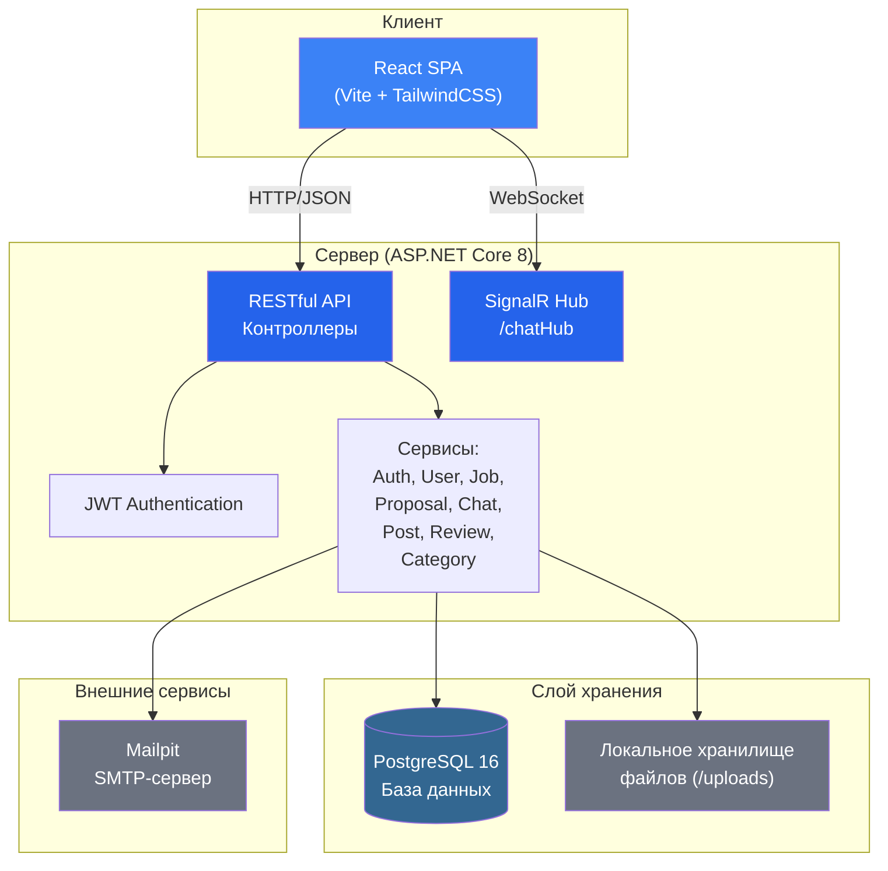
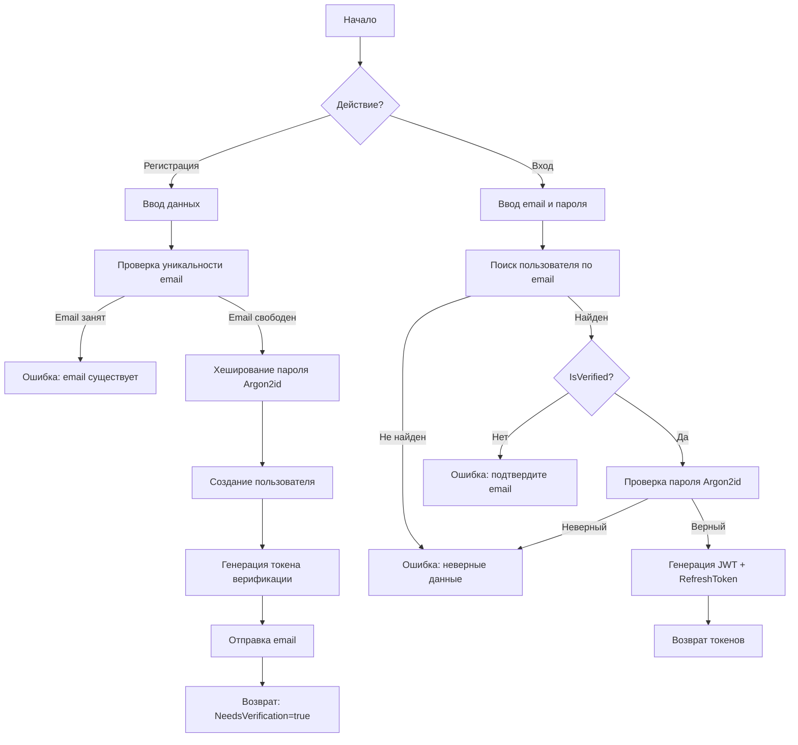
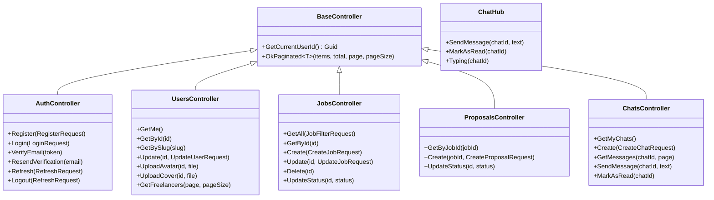

# Пояснительная записка дипломного проекта

## Введение

Развитие цифровой экономики и рост удалённой формы работы привели к существенному увеличению спроса на платформы, связывающие заказчиков с Digital-специалистами — дизайнерами, разработчиками, моушен-дизайнерами и другими профессионалами. По данным аналитических агентств, мировой рынок фриланс-платформ к 2025 году превысил 6 млрд долларов [7]. Однако существующие решения в основном ориентированы на англоязычную аудиторию и не учитывают специфику российского рынка: локальные нормы оплаты, кириллические имена, привычные способы коммуникации.

Целью настоящего дипломного проекта является разработка информационной системы «SYNQ» — одностраничного веб-приложения (SPA), предназначенного для поиска Digital-специалистов и публикации заданий. Платформа обеспечивает регистрацию и аутентификацию пользователей, поиск специалистов по категориям, создание и отклик на задания, обмен сообщениями в реальном времени, а также ведение профилей с портфолио и отзывами.

Для достижения поставленной цели были сформулированы следующие задачи:

1. Провести анализ предметной области и обзор существующих аналогов.
2. Сформулировать функциональные и нефункциональные требования к системе.
3. Обосновать выбор стека технологий.
4. Спроектировать архитектуру, интерфейсы и модель базы данных.
5. Реализовать серверную часть (API) и клиентскую часть (SPA).
6. Провести тестирование системы.
7. Разработать руководство пользователя.
8. Описать мероприятия по информационной безопасности.

# 1 Анализ предметной области

## 1.1 Описание предметной области

Предметной областью проекта является рынок цифровых услуг (digital-сервисов), в котором взаимодействуют две основные группы пользователей: заказчики и исполнители (фрилансеры). Заказчики формируют задания (задачи) с указанием бюджета, сроков, требуемых навыков и категории. Исполнители просматривают доступные задания, подают отклики с предложением цены и сроков, а также ведут профили с портфолио для привлечения заказчиков.

Основные бизнес-процессы:

— Регистрация и аутентификация пользователей с подтверждением электронной почты.
— Создание и редактирование профиля: аватар, обложка, биография, навыки, портфолио.
— Публикация заданий с указанием категории, бюджета, дедлайна и требуемых навыков.
— Поиск и фильтрация заданий по категории, бюджету, ключевым словам.
— Подача откликов на задания с указанием цены, сроков и сопроводительного письма.
— Обмен сообщениями в реальном времени между заказчиком и исполнителем.
— Публикация постов в профиле (кейсы, анонсы, описания процессов).
— Оставление отзывов и оценок по завершении работы.
— Просмотр категорий услуг с количеством доступных заданий.

## 1.2 Обзор аналогов

Для выявления сильных и слабых сторон существующих решений был проведён анализ четырёх наиболее популярных платформ.

**FL.ru** — крупнейшая российская платформа для фрилансеров. Предоставляет широкий функционал: каталог специалистов, безопасную сделку, портфолио, отзывы. Недостатки: перегруженный интерфейс, платная подписка для исполнителей, ограниченные возможности обмена сообщениями.

**Kwork.ru** — магазин цифровых услуг с фиксированной стоимостью кворков. Преимущества: простота использования, мгновенный старт работы. Недостатки: отсутствие гибкого ценообразования, ограниченные средства коммуникации, нет реального времени в чате.

**Upwork** — международная платформа с обширным функционалом: трекер времени, эскроу, мотивационные письма, рейтинги. Недостатки: высокая комиссия (до 20 %), сложный интерфейс для новых пользователей, отсутствие локализации для российского рынка.

**Fiverr** — маркетплейс gigs с системой уровней продавцов. Преимущества: визуальная подача услуг, система уровней, быстрый старт. Недостатки: англоязычный интерфейс, высокая комиссия, сложная система рейтинга.

Результаты сравнения представлены в таблице 1.

Таблица 1 — Сравнение аналогов

| Критерий | FL.ru | Kwork | Upwork | Fiverr | SYNQ |
|---|---|---|---|---|---|
| Локализация (русский язык) | Да | Да | Нет | Нет | Да |
| Реальное время (чат) | Частично | Нет | Да | Частично | Да |
| Гибкое ценообразование | Да | Нет | Да | Нет | Да |
| Верификация пользователей | Частично | Нет | Да | Да | Да |
| Категории Digital-услуг | Ограниченно | Да | Да | Да | Да |
| Современный интерфейс (SPA) | Нет | Частично | Да | Да | Да |
| Открытый исходный код | Нет | Нет | Нет | Нет | Да |

Таким образом, ни один из аналогов не предоставляет одновременно локализацию для русскоязычного рынка, обмен сообщениями в реальном времени, гибкое ценообразование и современный SPA-интерфейс. Разрабатываемая система SYNQ призвана закрыть этот пробел.

## 1.3 Требования к разрабатываемой ИС

### Функциональные требования

1. Регистрация и авторизация пользователей с ролями «Заказчик» и «Исполнитель».
2. Подтверждение адреса электронной почты при регистрации.
3. Просмотр, редактирование профиля, загрузка аватара и обложки.
4. Создание, редактирование и удаление заданий с указанием категории, бюджета, дедлайна, навыков.
5. Поиск и фильтрация заданий по ключевым словам, категории, бюджету.
6. Подача откликов на задания с указанием цены, сроков, сопроводительного письма.
7. Принятие или отклонение откликов заказчиком.
8. Обмен сообщениями в реальном времени между участниками.
9. Публикация постов в профиле (текст, кейс, анонс).
10. Отзыв с оценкой (от 1 до 5 звёзд) по завершении задания.
11. Просмотр категорий услуг.
12. Просмотр профилей других пользователей.

### Требования к интерфейсу

1. Адаптивный дизайн для мобильных устройств, планшетов и настольных ПК.
2. Интуитивная навигация с минималистичным интерфейсом.
3. Анимации переходов между страницами для повышения пользовательского опыта.
4. Использование стеклянного дизайна (glassmorphism) для ключевых элементов.
5. Поддержка русского языка во всех элементах интерфейса.
6. Модальные окна для детального просмотра заданий.
7. Визуальная индикация статусов (срочное задание, онлайн-статус, верификация).

## 1.4 Обоснование выбора стека технологий

**Клиентская часть (Frontend):**

— React 18 — библиотека для создания пользовательских интерфейсов. Выбрана благодаря компонентному подходу, виртуальной DOM, обширной экосистеме и широкому сообществу разработчиков [8].

— Vite 5 — инструмент сборки и разработки. Обеспечивает мгновенную горячую замену модулей (HMR), быструю сборку на основе ES-модулей, что значительно ускоряет процесс разработки по сравнению с Webpack [9].

— TailwindCSS 3 — утилитарный CSS-фреймворк. Позволяет быстро создавать согласованные интерфейсы без написания кастомных стилей, обеспечивает адаптивность и расширяемость через конфигурацию [10].

— Framer Motion — библиотека анимации для React. Используется для анимаций переходов между страницами, интерактивных элементов и модальных окон.

— Axios — HTTP-клиент для браузера. Обеспечивает перехватчики запросов, автоматическое добавление JWT-токенов и обработку истечения токена.

— SignalR клиент (@microsoft/signalr) — библиотека для обмена сообщениями в реальном времени по протоколу WebSocket.

— Lucide React — набор иконок с единообразным стилем.

— date-fns — модульная библиотека для работы с датами с поддержкой русской локали.

**Серверная часть (Backend):**

— ASP.NET Core 8 — кроссплатформенный веб-фреймворк от Microsoft. Выбран благодаря высокой производительности, встроенной поддержке внедрения зависимостей, промежуточных обработчиков и мощной системе маршрутизации [11].

— Entity Framework Core 8 — ORM для работы с базой данных. Поддерживает миграции, отслеживание изменений, LINQ-запросы.

— PostgreSQL 16 — объектно-реляционная СУБД. Обеспечивает надёжность, соответствие ACID, богатый тип данных и масштабируемость [12].

— SignalR — библиотека для обмена сообщениями в реальном времени, интегрированная в ASP.NET Core.

— JWT Bearer Authentication — стандарт аутентификации на основе JSON Web Token.

— MailKit — библиотека для отправки электронной почты по протоколу SMTP.

— Argon2id — алгоритм хеширования паролей, рекомендованный OWASP.

**Инфраструктура:**

— Docker Compose — инструмент для контейнеризации и оркестрации сервисов. Позволяет развёртывать всё приложение единообразно.

— Mailpit — SMTP-сервер для тестирования отправки электронной почты с веб-интерфейсом.

Сочетание выбранных технологий обеспечивает высокую производительность, безопасность, масштабируемость и удобство разработки как клиентской, так и серверной частей.

# 2 Проектирование

## 2.1 Проектирование системы

Архитектура разрабатываемой информационной системы построена по принципу «клиент-сервер» с разделением на три основных слоя: клиентское SPA-приложение (React), серверный API (ASP.NET Core) и слой хранения данных (PostgreSQL). Взаимодействие клиента и сервера осуществляется через RESTful API с использованием JSON, а для обмена сообщениями в реальном времени применяется протокол WebSocket через SignalR.

На рисунке 1 представлена обобщённая архитектура системы.



Рисунок 1 — Обобщённая архитектура информационной системы SYNQ

Серверная часть реализована по паттерну Clean Architecture с четырьмя проектами: Synq.Domain (сущности и интерфейсы), Synq.Infrastructure (доступ к данным и внешние сервисы), Synq.Application (бизнес-логика и DTO), Synq.WebApi (контроллеры и конфигурация).

## 2.2 Определение группы пользователей

Система предусматривает две основные группы пользователей:

1. Заказчик (Client) — пользователь, создающий задания, просматривающий отклики, выбирающий исполнителя, обменивающийся сообщениями и оставляющий отзывы.

2. Исполнитель (Freelancer) — пользователь, просматривающий доступные задания, подающий отклики, ведущий профиль с портфолио и постами, обменивающийся сообщениями и получающий отзывы.

Диаграмма прецедентов (вариантов использования) представлена на рисунке 2.

```mermaid
left-right
graph LR
    subgraph Заказчик
        C1["Создать задание"]
        C2["Редактировать задание"]
        C3["Удалить задание"]
        C4["Просмотреть отклики"]
        C5["Принять/отклонить отклик"]
        C6["Написать отзыв"]
        C7["Обмениваться сообщениями"]
        C8["Редактировать профиль"]
        C9["Просмотреть категории"]
    end
    
    subgraph Исполнитель
        F1["Просмотреть задания"]
        F2["Подать отклик"]
        F3["Редактировать профиль"]
        F4["Опубликовать пост"]
        F5["Обмениваться сообщениями"]
        F6["Загрузить аватар/обложку"]
        F7["Просмотреть категории"]
    end
    
    subgraph Общее
        A1["Зарегистрироваться"]
        A2["Войти в систему"]
        A3["Подтвердить email"]
        A4["Обновить токен"]
    end
```

Рисунок 2 — Диаграмма прецедентов

## 2.3 Функциональное моделирование

Ключевые модули системы и их взаимодействие:

1. Модуль аутентификации (Auth) — регистрация, вход, верификация email, обновление и отзыв токенов.
2. Модуль пользователей (Users) — просмотр и редактирование профиля, загрузка файлов, поиск фрилансеров.
3. Модуль заданий (Jobs) — создание, редактирование, удаление, фильтрация, изменение статуса.
4. Модуль откликов (Proposals) — подача отклика, принятие, отклонение.
5. Модуль чата (Chat) — создание чата, отправка и получение сообщений в реальном времени, отметка прочитанным.
6. Модуль постов (Posts) — создание, редактирование, удаление, лайки.
7. Модуль отзывов (Reviews) — создание отзыва с оценкой, просмотр отзывов пользователя.
8. Модуль категорий (Categories) — просмотр списка и получение по slug.

На рисунке 3 представлена диаграмма последовательности для процесса подачи отклика на задание.

```mermaid
sequenceDiagram
    participant И as Исполнитель
    participant SPA as React SPA
    participant API as Web API
    participants Сервисы as Сервисы
    participant DB as PostgreSQL
    
    И->>SPA: Нажимает «Откликнуться»
    SPA->>API: POST /api/proposals/job/{jobId}
    API->>Сервисы: ProposalService.CreateAsync()
    Сервисы->>DB: INSERT INTO Proposals
    DB-->>Сервисы: Результат
    Сервисы-->>API: ProposalDto
    API-->>SPA: 200 OK
    SPA-->>И: Уведомление об успехе
    
    Note over И,DB: Принятие отклика заказчиком
    
    participant З as Заказчик
    З->>SPA: Нажимает «Принять»
    SPA->>API: PATCH /api/proposals/{id}/status
    API->>Сервисы: ProposalService.UpdateStatusAsync(Accepted)
    Сервисы->>DB: UPDATE Proposals SET Status='Accepted'
    Сервисы->>DB: UPDATE Jobs SET Status='InProgress'
    DB-->>Сервисы: OK
    Сервисы-->>API: ProposalDto
    API-->>SPA: 200 OK
    SPA-->>З: Статус обновлён
```

Рисунок 3 — Диаграмма последовательности: подача и принятие отклика

На рисунке 4 представлена блок-схема основного алгоритма аутентификации пользователя.



Рисунок 4 — Блок-схема алгоритма аутентификации

## 2.4 Разработка модели базы данных

База данных спроектирована на основе реляционной модели и реализована с использованием PostgreSQL 16. Система содержит 16 таблиц, связанных через 23 внешних ключа с заданными правилами удаления (Cascade, Restrict, SetNull). Перечислимые типы (UserRole, JobStatus, BudgetType, ProposalStatus) хранятся как строки (varchar(32)). Всего в базе 73 столбца, 4 уникальных индекса, 3 составных первичных ключа.

Диаграмма базы данных представлена на рисунке 5.

[ЗАМЕСТИТЕЛЬ: Здесь следует вставить диаграмму базы данных из DBeaver — заменить этот текст на изображение]

Ниже приведено описание всех таблиц базы данных.

**Таблица Users** — содержит информацию о зарегистрированных пользователях.

| Поле | Тип | Обязательное | Описание |
|---|---|---|---|
| Id | uuid | Да | Первичный ключ |
| Email | varchar(256) | Да | Email, уникальный индекс |
| PasswordHash | varchar(512) | Да | Хеш пароля (Argon2id) |
| Name | varchar(128) | Да | Имя пользователя |
| Role | varchar(32) | Да | Роль: Client или Freelancer |
| AvatarUrl | varchar(1024) | Нет | URL аватара |
| CoverUrl | varchar(1024) | Нет | URL обложки профиля |
| Bio | varchar(2000) | Нет | Биография |
| Location | varchar(256) | Нет | Местоположение |
| YearsOfExperience | integer | Нет | Опыт работы в годах |
| IsVerified | boolean | Да | Подтверждён ли email |
| Rating | numeric(2,1) | Да | Средний рейтинг (0,0–5,0) |
| ReviewsCount | integer | Да | Количество отзывов |
| CompletedJobs | integer | Да | Количество завершённых заданий |
| HourlyRate | numeric(10,2) | Нет | Почасовая ставка в рублях |
| PortfolioUrl | varchar(1024) | Нет | Ссылка на портфолио |
| PortfolioFileUrl | varchar(1024) | Нет | URL файла портфолио |
| CreatedAt | timestamp with time zone | Да | Дата регистрации, по умолчанию NOW() |

**Таблица Categories** — категории услуг.

| Поле | Тип | Обязательное | Описание |
|---|---|---|---|
| Id | uuid | Да | Первичный ключ |
| Name | varchar(128) | Да | Название категории |
| Slug | varchar(128) | Да | URL-идентификатор, уникальный индекс |
| Icon | varchar(64) | Да | Имя иконки (Lucide) |
| Description | varchar(1000) | Да | Описание категории |
| ImageUrl | varchar(1024) | Нет | URL изображения |
| Color | varchar(64) | Нет | Цвет (CSS-класс градиента) |

**Таблица Jobs** — задания, созданные заказчиками.

| Поле | Тип | Обязательное | Описание |
|---|---|---|---|
| Id | uuid | Да | Первичный ключ |
| Title | varchar(256) | Да | Название задания |
| Description | varchar(5000) | Да | Описание задания |
| CategoryId | uuid | Да | FK → Categories.Id, onDelete: Cascade |
| BudgetMin | numeric(10,2) | Да | Минимальный бюджет |
| BudgetMax | numeric(10,2) | Да | Максимальный бюджет |
| BudgetType | varchar(32) | Да | Тип бюджета: Fixed или Hourly |
| Deadline | timestamp with time zone | Нет | Срок выполнения |
| IsUrgent | boolean | Да | Признак срочности, по умолчанию false |
| Status | varchar(32) | Да | Статус: Open, InProgress, Completed, Cancelled |
| ClientId | uuid | Да | FK → Users.Id, onDelete: Restrict |
| CreatedAt | timestamp with time zone | Да | Дата создания, по умолчанию NOW() |

**Таблица Skills** — справочник навыков.

| Поле | Тип | Обязательное | Описание |
|---|---|---|---|
| Name | varchar(64) | Да | Первичный ключ, название навыка |

**Таблица JobSkills** — связь многие-ко-многим между заданиями и навыками. Составной первичный ключ (JobId, SkillName).

| Поле | Тип | Обязательное | Описание |
|---|---|---|---|
| JobId | uuid | Да | FK → Jobs.Id, onDelete: Cascade |
| SkillName | varchar(64) | Да | FK → Skills.Name, onDelete: Cascade |

**Таблица JobAttachments** — вложения к заданиям.

| Поле | Тип | Обязательное | Описание |
|---|---|---|---|
| Id | uuid | Да | Первичный ключ |
| JobId | uuid | Да | FK → Jobs.Id, onDelete: Cascade |
| FileName | varchar(256) | Да | Имя файла |
| FileUrl | varchar(1024) | Да | URL файла |

**Таблица Proposals** — отклики исполнителей на задания.

| Поле | Тип | Обязательное | Описание |
|---|---|---|---|
| Id | uuid | Да | Первичный ключ |
| JobId | uuid | Да | FK → Jobs.Id, onDelete: Cascade |
| UserId | uuid | Да | FK → Users.Id, onDelete: Restrict |
| Price | numeric(10,2) | Да | Предлагаемая цена в рублях |
| DeadlineDays | integer | Да | Срок выполнения в днях |
| CoverLetter | varchar(3000) | Да | Сопроводительное письмо |
| Status | varchar(32) | Да | Статус: Pending, Accepted, Rejected |
| CreatedAt | timestamp with time zone | Да | Дата создания, по умолчанию NOW() |

**Таблица ProposalSkills** — связь многие-ко-многим между откликами и навыками. Составной первичный ключ (ProposalId, SkillName).

| Поле | Тип | Обязательное | Описание |
|---|---|---|---|
| ProposalId | uuid | Да | FK → Proposals.Id, onDelete: Cascade |
| SkillName | varchar(64) | Да | FK → Skills.Name, onDelete: Cascade |

**Таблица Chats** — чаты между двумя пользователями.

| Поле | Тип | Обязательное | Описание |
|---|---|---|---|
| Id | uuid | Да | Первичный ключ |
| UserId | uuid | Да | FK → Users.Id (первый участник), onDelete: Restrict |
| ParticipantId | uuid | Да | FK → Users.Id (второй участник), onDelete: Restrict |
| JobId | uuid | Нет | FK → Jobs.Id, onDelete: SetNull |
| LastMessage | varchar(500) | Нет | Текст последнего сообщения |
| LastMessageAt | timestamp with time zone | Нет | Время последнего сообщения |
| UnreadCount | integer | Да | Количество непрочитанных сообщений |
| CreatedAt | timestamp with time zone | Да | Дата создания, по умолчанию NOW() |

**Таблица Messages** — сообщения в чатах.

| Поле | Тип | Обязательное | Описание |
|---|---|---|---|
| Id | uuid | Да | Первичный ключ |
| ChatId | uuid | Да | FK → Chats.Id, onDelete: Cascade |
| SenderId | uuid | Да | FK → Users.Id, onDelete: Restrict |
| Text | varchar(5000) | Да | Текст сообщения |
| IsRead | boolean | Да | Признак прочтения, по умолчанию false |
| CreatedAt | timestamp with time zone | Да | Дата отправки, по умолчанию NOW() |

Индексы: IX_Messages_ChatId, IX_Messages_ChatId_CreatedAt (составной), IX_Messages_SenderId.

**Таблица MessageAttachments** — вложения к сообщениям.

| Поле | Тип | Обязательное | Описание |
|---|---|---|---|
| Id | uuid | Да | Первичный ключ |
| MessageId | uuid | Да | FK → Messages.Id, onDelete: Cascade |
| FileName | varchar(256) | Да | Имя файла |
| FileUrl | varchar(1024) | Да | URL файла |

**Таблица Posts** — публикации в профилях пользователей.

| Поле | Тип | Обязательное | Описание |
|---|---|---|---|
| Id | uuid | Да | Первичный ключ |
| UserId | uuid | Да | FK → Users.Id, onDelete: Cascade |
| Title | varchar(256) | Да | Заголовок поста |
| Content | varchar(5000) | Да | Содержание поста |
| LikesCount | integer | Да | Количество лайков |
| CommentsCount | integer | Да | Количество комментариев |
| CreatedAt | timestamp with time zone | Да | Дата создания, по умолчанию NOW() |

**Таблица PostLikes** — лайки постов. Составной первичный ключ (PostId, UserId).

| Поле | Тип | Обязательное | Описание |
|---|---|---|---|
| PostId | uuid | Да | FK → Posts.Id, onDelete: Cascade |
| UserId | uuid | Да | FK → Users.Id, onDelete: Cascade |

**Таблица Reviews** — отзывы пользователей.

| Поле | Тип | Обязательное | Описание |
|---|---|---|---|
| Id | uuid | Да | Первичный ключ |
| UserId | uuid | Да | FK → Users.Id (получатель отзыва), onDelete: Restrict |
| AuthorId | uuid | Да | FK → Users.Id (автор отзыва), onDelete: Restrict |
| Rating | integer | Да | Оценка от 1 до 5 |
| Text | varchar(2000) | Да | Текст отзыва |
| JobId | uuid | Нет | FK → Jobs.Id, onDelete: SetNull |
| CreatedAt | timestamp with time zone | Да | Дата создания, по умолчанию NOW() |

**Таблица RefreshTokens** — refresh-токены для обновления JWT.

| Поле | Тип | Обязательное | Описание |
|---|---|---|---|
| Id | uuid | Да | Первичный ключ |
| UserId | uuid | Да | FK → Users.Id, onDelete: Cascade |
| Token | varchar(512) | Да | Значение токена, уникальный индекс |
| ExpiresAt | timestamp with time zone | Да | Дата истечения |
| IsRevoked | boolean | Да | Признак отзыва токена |
| CreatedAt | timestamp with time zone | Да | Дата создания, по умолчанию NOW() |

**Таблица EmailVerificationTokens** — токены подтверждения email.

| Поле | Тип | Обязательное | Описание |
|---|---|---|---|
| Id | uuid | Да | Первичный ключ |
| UserId | uuid | Да | FK → Users.Id, onDelete: Cascade |
| Token | varchar(256) | Да | Значение токена, уникальный индекс |
| ExpiresAt | timestamp with time zone | Да | Дата истечения |
| IsUsed | boolean | Да | Признак использования, по умолчанию false |
| CreatedAt | timestamp with time zone | Да | Дата создания, по умолчанию NOW() |

Связи между таблицами:

— Users (1) → (N) Jobs — по полю ClientId. При удалении пользователя задания сохраняются (Restrict).
— Users (1) → (N) Proposals — по полю UserId. При удалении пользователя отклики сохраняются (Restrict).
— Users (1) → (N) Posts — по полю UserId. При удалении пользователя посты удаляются (Cascade).
— Users (1) → (N) Reviews — по полям UserId и AuthorId. При удалении пользователя отзывы сохраняются (Restrict).
— Users (1) → (N) Chats — по полям UserId и ParticipantId. При удалении пользователя чаты сохраняются (Restrict).
— Users (1) → (N) Messages — по полю SenderId. При удалении пользователя сообщения сохраняются (Restrict).
— Users (1) → (N) PostLikes — по полю UserId. При удалении пользователя лайки удаляются (Cascade).
— Users (1) → (N) RefreshTokens — по полю UserId. При удалении пользователя токены удаляются (Cascade).
— Users (1) → (N) EmailVerificationTokens — по полю UserId. При удалении пользователя токены удаляются (Cascade).
— Categories (1) → (N) Jobs — по полю CategoryId. При удалении категории задания удаляются (Cascade).
— Jobs (1) → (N) JobSkills — по полю JobId. При удалении задания навыки удаляются (Cascade).
— Jobs (1) → (N) JobAttachments — по полю JobId. При удалении задания вложения удаляются (Cascade).
— Jobs (1) → (N) Proposals — по полю JobId. При удалении задания отклики удаляются (Cascade).
— Jobs (1) → (N) Chats — по полю JobId. При удалении задания JobId обнуляется (SetNull).
— Jobs (1) → (N) Reviews — по полю JobId. При удалении задания JobId обнуляется (SetNull).
— Skills (1) → (N) JobSkills — по полю SkillName. При удалении навыка связи удаляются (Cascade).
— Skills (1) → (N) ProposalSkills — по полю SkillName. При удалении навыка связи удаляются (Cascade).
— Proposals (1) → (N) ProposalSkills — по полю ProposalId. При удалении отклика навыки удаляются (Cascade).
— Chats (1) → (N) Messages — по полю ChatId. При удалении чата сообщения удаляются (Cascade).
— Messages (1) → (N) MessageAttachments — по полю MessageId. При удалении сообщения вложения удаляются (Cascade).
— Posts (1) → (N) PostLikes — по полю PostId. При удалении поста лайки удаляются (Cascade).

## 2.5 Проектирование интерфейсов

Проектирование интерфейса велось с учётом принципов минимализма, адаптивности и современного подхода glassmorphism (стеклянный дизайн).

Цветовая палитра:

— Основной цвет (primary): #2563eb (синий), с градациями от 50 (#eff6ff) до 700 (#1d4ed8).
— Серый (gray): шкала от 50 (#f9fafb) до 900 (#111827).
— Успех (success): #10b981, предупреждение (warning): #f59e0b, ошибка (error): #ef4444.

Типографика: шрифт Inter (веса 300–900), системный стек: Inter, system-ui, sans-serif.

Адаптивность: используется мобильная-first стратегия с контрольными точками TailwindCSS (sm, md, lg, xl). Шапка сайта перестраивается в мобильное меню, сетки карточек адаптируются от 1 до 3 столбцов.

Компоненты пользовательского интерфейса:

— Button — кнопка с вариантами primary, secondary, outline, ghost, danger и размерами sm, md, lg. Анимация нажатия через Framer Motion.
— Input — поле ввода с поддержкой режимов: текст, email, пароль, поиск, textarea, число, дата. Отображение ошибок валидации.
— Card — карточка-контейнер с опциональными эффектами при наведении.
— Badge — метка с вариантами цвета (primary, success, warning, error, gray).
— Avatar — аватар с поддержкой инициалов при отсутствии изображения, индикатором онлайн и знаком верификации.
— Modal — модальное окно с анимацией входа/выхода, поддержкой размеров (sm, md, lg, xl), блокировкой скролла.
— Header — sticky-шапка с эффектом glass (backdrop-blur), адаптивным поиском, навигацией и меню пользователя.
— Footer — тёмный подвал с колонками ссылок, логотипом и копирайтом.

[ЗАМЕСТИТЕЛЬ: Здесь следует вставить макеты ключевых страниц — главная, список заданий, профиль, чат]

# 3 Реализация

## 3.1 Реализация основных функций

Система реализована как два взаимодействующих приложения:

1. Клиентское SPA-приложение (React 18 + Vite).
2. Серверное API-приложение (ASP.NET Core 8).

Серверная часть (Backend):

API построен на контроллерах ASP.NET Core с атрибутом [ApiController] и маршрутизацией по шаблону api/[controller]. Базовый контроллер предоставляет метод GetCurrentUserId() для извлечения идентификатора пользователя из JWT-токена.

Аутентификация реализована на основе JWT сRefresh-токенами. При регистрации создаётся пользователь с хешированным паролем (Argon2id), генерируется токен верификации email. После подтверждения выдаётся пара access-токен (60 минут) и refresh-токен (7 дней). При истечении access-токена клиент автоматически запрашивает новый через /api/auth/refresh.

Авторизация использует атрибут [Authorize] на уровне отдельных действий контроллера. Проверка прав ownership выполняется в сервисах: только автор может редактировать/удалять свои задания, посты, только заказчик задания может менять статус отклика.

На рисунке 6 представлена диаграмма классов серверной части.



Рисунок 6 — Диаграмма классов серверной части (контроллеры)

Клиентская часть (Frontend):

Точка входа — файл src/main.jsx, подключающий BrowserRouter и корневой компонент App. Роутинг реализован через React Router v6 с 8 маршрутами:

— / — HomePage (публичный);
— /auth — AuthPage (публичный);
— /categories — CategoriesPage (защищённый);
— /jobs — JobsPage (защищённый);
— /job/:id/proposals — JobProposalsPage (защищённый);
— /profile/:id — ProfilePage (защищённый);
— /chat — ChatPage (защищённый);
— /create-job — CreateJobPage (защищённый).

Управление состоянием реализовано через React Context + useReducer (файл src/store/index.jsx). Контекст предоставляет: selectedJob, isJobModalOpen, activeChat, jobFilters, isAuthenticated, currentUser, notifications. Доступ осуществляется исключительно через хук useAppContext().

API-клиент (src/api/) использует Axios с перехватчиками: запрос — добавление JWT Bearer-токена из localStorage; ответ — при получении 401 автоматическая попытка обновления токена через /api/auth/refresh.

Сервис SignalR (src/api/signalrService.js) реализован как Singleton-класс: подключение к /chatHub, обработка событий ReceiveMessage, MessageSent, ChatUpdated, UserTyping, MessagesRead, UserOnline, UserOffline.

## 3.2 Реализация интерфейсов

Интерфейс реализован в виде одностраничного приложения (SPA) с использованием React-компонентов и TailwindCSS.

Страницы:

— HomePage — электространица с hero-секцией, статистикой, блоком категорий (6 карточек с градиентами и иконками Lucide), блоком избранных заданий (последние 4 задания), секцией преимуществ и отзывов.

— AuthPage — форма входа/регистрации с переключением вкладок, валидацией полей, выбором роли (Заказчик/Исполнитель), отображением ошибок сервера.

— CategoriesPage — сетка из 6 категорий с иконками, описаниями и количеством заданий. Первая и четвёртая карточки занимают 2 столбца.

— JobsPage — поиск по ключевым словам, фильтры по категории, минимальный и максимальный бюджет, сортировка (новые, по бюджету, по дедлайну). Задания отображаются в макетной раскладке (masonry layout).

— JobProposalsPage — детальная информация о задании, список откликов с помощью ProposalCard (аватар, имя, рейтинг, навыки, сопроводительное письмо, цена, сроки).

— ProfilePage — обложка, аватар с бейджем верификации, статистика (завершённые задания, отзывы, рейтинг, тариф), биография, портфолио, посты, отзывы. Для собственного профиля — редактирование и создание постов.

— ChatPage — трёхколоночная раскладка: список чатов (слева), область сообщений (центр), панель информации о проекте (справа). Обмен сообщениями через SignalR в реальном времени.

— CreateJobPage — форма создания задания: разделы основной информации, бюджета и сроков, требуемых навыков, вложений. Валидация обязательных полей.

Анимации: переходы между страницами реализованы через AnimatePresence (Framer Motion), анимация карточек при наведении (whileHover), модальные окна с эффектом появления/исчезновения.

Маршрутизация и защита: компонент ProtectedRoute проверяет наличие аутентификации и перенаправляет неавторизованных на /auth.

# 4 Тестирование

В связи с отсутствием развёрнутой инфраструктуры тестирования в настоящем проекте было проведено ручное функциональное тестирование по основным сценариям использования.

Таблица 2 — Результаты функционального тестирования

| № | Сценарий | Ожидаемый результат | Фактический результат | Статус |
|---|---|---|---|---|
| 1 | Регистрация нового пользователя | Создание аккаунта, отправка email-подтверждения | Аккаунт создан, email отправлен | Пройден |
| 2 | Подтверждение email | Активация аккаунта, получение JWT-токенов | Аккаунт активирован, токены получены | Пройден |
| 3 | Вход в систему | Аутентификация, получение JWT | Аутентификация успешна | Пройден |
| 4 | Обновление просроченного access-токена | Автоматическое обновление через refresh-токен | Токен обновлён, запрос повторён | Пройден |
| 5 | Создание задания | Задание создано со статусом Open | Задание создано корректно | Пройден |
| 6 | Фильтрация заданий | Отображение отфильтрованного списка | Фильтры работают корректно | Пройден |
| 7 | Подача отклика | Создание отклика со статусом Pending | Отклик создан | Пройден |
| 8 | Принятие отклика | Изменение статуса на Accepted, задания — InProgress | Статусы обновлены | Пройден |
| 9 | Обмен сообщениями в реальном времени | Отправка и мгновенное получение сообщения | Сообщения доставляются в реальном времени | Пройден |
| 10 | Редактирование профиля | Обновление данных профиля | Данные обновлены | Пройден |
| 11 | Загрузка аватара | Сохранение файла и обновление URL | Аватар сохранён и отображён | Пройден |
| 12 | Публикация поста | Создание поста в профиле | Пост создан и отображён | Пройден |
| 13 | Отзыв с оценкой | Создание отзыва, обновление среднего рейтинга | Отзыв создан, рейтинг пересчитан | Пройден |
| 14 | Лайк/дизлайк поста | Переключение лайка | Лайк корректно toggled | Пройден |
| 15 | Адаптивность интерфейса | Корректное отображение на экранах 320–1920px | Интерфейс адаптируется | Пройден |

[ЗАМЕСТИТЕЛЬ: Здесь следует вставить скриншоты результатов тестирования]

# 5 Руководство пользователя

## 5.1 Описание установки

Для установки и запуска системы необходимо:

1. Установить Docker и Docker Compose на сервер или рабочую станцию.
2. Клонировать репозиторий проекта: git clone <url-репозитория>.
3. Перейти в корневую директорию проекта.
4. Выполнить команду: docker-compose up --build.
5. Дождаться запуска всех сервисов (PostgreSQL, Backend, Frontend, Mailpit).

После запуска доступны следующие сервисы:

— Frontend: http://localhost:3000
— Backend API: http://localhost:5000
— Swagger: http://localhost:5000/swagger
— Mailpit (отладка email): http://localhost:8025

## 5.2 Описание запуска

При запуске Docker Compose автоматически:

1. Поднимает контейнер PostgreSQL (порт 5438) и создаёт базу данных «synq».
2. Применяет миграции Entity Framework Core к базе данных.
3. Заполняет базу начальными данными ( seeded data): тестовые пользователи, категории, навыки, задания.
4. Запускает backend на порту 5000.
5. Запускает frontend на порту 3000.

Тестовые аккаунты:

— Заказчик: client@synq.app / password123
— Исполнитель: freelancer@synq.app / password123

## 5.3 Инструкции по работе

### Регистрация и вход

1. Открыть приложение по адресу http://localhost:3000.
2. Нажать кнопку «Войти» в шапке страницы.
3. На вкладке «Регистрация» заполнить поля: имя, email, пароль, подтверждение пароля, выбрать роль (Заказчик или Исполнитель).
4. Нажать «Зарегистрироваться» — на указанный email будет отправлено письмо с подтверждением.
5. Перейти по ссылке из письма для активации аккаунта.
6. После активации войти с помощью email и пароля.

### Создание задания (для заказчика)

1. Авторизоваться в роли Заказчика.
2. Нажать кнопку «Создать задание» в шапке.
3. Заполнить форму: название, категория, описание, бюджет (мин/макс), дедлайн, требуемые навыки, срочность.
4. Нажать «Опубликовать» — задание появится в общем списке.

### Подача отклика (для исполнителя)

1. Авторизоваться в роли Исполнителя.
2. Перейти на страницу «Задания».
3. Выбрать задание для просмотра деталей (модальное окно).
4. Нажать «Откликнуться», заполнить сопроводительное письмо, указать цену и сроки.
5. Отправить отклик.

### Обмен сообщениями

1. Перейти на страницу «Чат».
2. Выбрать существующий чат из списка или создать новый через профиль пользователя.
3. Ввести сообщение в поле ввода и нажать отправку или Enter.
4. Сообщения доставляются в реальном времени через WebSocket.

### Редактирование профиля

1. Перейти на страницу своего профиля.
2. Нажать кнопку «Редактировать».
3. Изменить необходимые поля: имя, биографию, локацию, тариф, опыт, портфолио.
4. Загрузить аватар или обложку.
5. Сохранить изменения.

# 6 Мероприятия по информационной безопасности

## 6.1 Возможные угрозы информационной безопасности

При эксплуатации разрабатываемой информационной системы возможны следующие угрозы:

1. Несанкционированный доступ к учётным записям пользователей — угроза перехвата JWT-токенов или подбора паролей.
2. Межсайтовый скриптинг (XSS) — внедрение вредоносного скрипта в данные, вводимые пользователем (заголовки заданий, описания, сообщения).
3. SQL-инъекции — внедрение вредоносного SQL-кода через поля ввода.
4. Перехват данных при передаче — угроза чтения трафика между клиентом и сервером.
5. Несанкционированное выполнение действий от имени другого пользователя — подмена идентификаторов.
6. Атаки перебора (brute force) — множественные попытки подбора пароля.
7. Утечка чувствительных данных — паролей, токенов, личной информации.

## 6.2 Принятые меры

### 6.2.1 Разграничение доступа

Система реализует ролевую модель доступа с двумя ролями: Заказчик (Client) и Исполнитель (Freelancer). Разграничение доступа представлено в таблице 3.

Таблица 3 — Матрица разграничения доступа

| Функция | Неавторизованный | Заказчик | Исполнитель |
|---|---|---|---|
| Просмотр заданий | Да | Да | Да |
| Просмотр категорий | Да | Да | Да |
| Просмотр профилей | Да | Да | Да |
| Создание задания | Нет | Да | Нет |
| Подача отклика | Нет | Нет | Да |
| Принятие отклика | Нет | Да | Нет |
| Обмен сообщениями | Нет | Да | Да |
| Редактирование профиля | Нет | Да | Да |
| Создание поста | Нет | Нет | Да |
| Написание отзыва | Нет | Да | Да |
| Загрузка файлов | Нет | Да | Да |

### 6.2.2 Безопасная идентификация, аутентификация и авторизация

Идентификация пользователей осуществляется по уникальному адресу электронной почты (email). При регистрации электронная почта подтверждается через токен верификации, отправляемый на указанный адрес.

Аутентификация реализована на основе JWT (JSON Web Token). При успешном входе генерируется access-токен (срок действия — 60 минут) и refresh-токен (срок действия — 7 дней). Access-токен содержит claims: идентификатор пользователя (NameIdentifier), email, имя, роль.

Refresh-токен хранится в базе данных с привязкой к пользователю и может быть отозван при выходе из системы. Механизм обновления токенов использует стратегию вращения: при каждом обновлении выдаётся новая пара токенов, а старый refresh-токен помечается как отозванный.

Авторизация осуществляется на уровне контроллеров ASP.NET Core с использованием атрибута [Authorize]. Проверка владельца ресурса выполняется в сервисном слое: идентификатор пользователя извлекается из JWT-claims и сравнивается с владельцем ресурса.

Пароли хранятся в хешированном виде с использованием алгоритма Argon2id, рекомендованного OWASP. Параметры: 16-байтовая соль, 32-байтовый ключ, 64 МБ памяти, 3 итерации, 4 степени параллелизма.

[ЗАМЕСТИТЕЛЬ: Здесь следует вставить пример кода хеширования пароля и скриншот работы аутентификации]

### 6.2.3 Безопасное хранение данных и резервное копирование

Данные пользователей хранятся в СУБД PostgreSQL 16, обеспечивающей соответствие ACID. Пароли хранятся исключительно в хешированном виде (Argon2id) и не могут быть восстановлены в исходном виде. Чувствительные данные (JWT-токены) на клиенте хранятся в localStorage и удаляются при выходе из системы.

Для резервного копирования рекомендуется использовать встроенные средства PostgreSQL (pg_dump) с настройкой автоматических ежедневных бэкапов. В контейнерной среде Docker возможна интеграция с системами резервного копирования томов (volumes).

### 6.2.4 Защита кода от неправомерного использования

Для защиты исходного кода клиентского приложения при развёртывании в продакшн-среде применяется минификация (minification) и обфускация JavaScript-кода средствами Vite (esbuild). Серверный код компилируется в промежуточный язык (IL) .NET, что затрудняет его декомпиляцию.

### 6.2.5 Защита авторского права

На страницеFooter и в шапке приложения размещён знак охраны авторского права: © 2024 SYNQ. Все права защищены.

## 6.3 Рекомендации пользователям по безопасной работе

1. Использовать сложные пароли длиной не менее 8 символов, включающие прописные и строчные буквы, цифры и специальные символы.
2. Не передавать учётные данные третьим лицам.
3. Регулярно обновлять пароли (рекомендуется не реже одного раза в 90 дней).
4. При завершении работы выходить из системы с помощью кнопки «Выйти» для удаления токенов из хранилища браузера.
5. Использовать защищённое HTTPS-соединение при развёртывании в продакшн-среде.
6. Не переходить по подозрительным ссылкам, полученным в сообщениях чата.
7. Рекомендуется использовать VPN-подключение при работе с приложением через открытые сети.

# Заключение

В ходе выполнения дипломного проекта была разработана информационная система SYNQ — платформа для поиска Digital-специалистов и публикации заданий. Система реализована как одностраничное веб-приложение (React 18 + Vite) с серверным API на ASP.NET Core 8 и базой данных PostgreSQL 16.

В ходе работы были решены следующие задачи:

1. Проведён анализ предметной области и обзор аналогов, выявивший потребность в русскоязычной платформе с обменом сообщениями в реальном времени.
2. Сформулированы функциональные и нефункциональные требования к системе.
3. Обоснован выбор стека технологий: React 18, Vite 5, TailwindCSS 3, ASP.NET Core 8, Entity Framework Core 8, PostgreSQL 16, SignalR.
4. Спроектирована архитектура системы, модель базы данных (16 таблиц, 73 столбца, 23 внешних ключа), интерфейсы пользователя и описаны прецеденты использования.
5. Реализована серверная часть с 8 контроллерами, 8 сервисами, JWT-аутентификацией, SignalR-чатом и email-верификацией.
6. Реализована клиентская часть с 8 страницами, 11 компонентами, контекстом состояния и API-клиентом.
7. Проведено ручное функциональное тестирование по 15 сценариям.
8. Разработано руководство пользователя по установке и работе с системой.
9. Описаны мероприятия по информационной безопасности: разгрраничение доступа, JWT-аутентификация, хеширование паролей (Argon2id), резервное копирование.

Практическая значимость работы заключается в создании полнофункциональной платформы, объединяющей ключевые возможности существующих аналогов с учётом специфики русскоязычного рынка и обеспечивающей обмен сообщениями в реальном времени.

Предложения по совершенствованию:

1. Добавление системы безопасной сделки (эскроу) для финансовых расчётов между заказчиком и исполнителем.
2. Реализация уведомлений в реальном времени (push-уведомления, email-оповещения).
3. Добавление интеграции с платёжными системами (ЮKassa, Тинькофф Оплата).
4. Разработка мобильного приложения на React Native.
5. Внедрение системы рекомендаций на основе машинного обучения для подбора исполнителей.
6. Добавление автоматизированного тестирования (unit-тесты, интеграционные тесты).

# Список источников

Нормативная документация

1) ГОСТ 34.602-2020 Информационные технологии. Комплекс стандартов на автоматизированные системы. Техническое задание на создание автоматизированной системы [Электронный ресурс] - https://protect.gost.ru/document.aspx?control=7&id=209801

2) ГОСТ 34.201-2020 Информационные технологии. Комплекс стандартов на автоматизированные системы. Виды, комплектность и обозначение документов при создании автоматизированных систем [Электронный ресурс] - https://protect.gost.ru/document.aspx?control=7&id=209765

3) ГОСТ Р ИСО/МЭК 25051-2017 — Информационные технологии. Системная и программная инженерия. Требования и оценка качества систем и программного обеспечения (SQuaRE). Требования к качеству готового к использованию программного продукта [Электронный ресурс] - https://protect.gost.ru/document.aspx?control=7&id=210409

4) ГОСТ 19.106-78 Единая система программной документации. Требования к программным документам, выполненным печатным способом [Электронный ресурс] - https://protect.gost.ru/document.aspx?control=7&id=155463

5) ГОСТ 19.401-78 Единая система программной документации. Текст программы. Требования к содержанию и оформлению [Электронный ресурс] - https://protect.gost.ru/document.aspx?control=7&id=155463

6) ГОСТ Р 2.105-2019 Единая система конструкторской документации. Общие требования к текстовым документам [Электронный ресурс] - https://protect.gost.ru/document1.aspx?control=31&baseC=6&page=0&month=

Интернет – ресурсы

7) Statista. Freelance platforms market size worldwide [Электронный ресурс] - https://www.statista.com/outlook/digital-services/freelance-platforms/worldwide

8) React. Документация библиотеки React [Электронный ресурс] - https://react.dev/

9) Vite.js. Документация инструмента сборки Vite [Электронный ресурс] - https://vitejs.dev/

10) TailwindCSS. Документация CSS-фреймворка [Электронный ресурс] - https://tailwindcss.com/

11) Microsoft. ASP.NET Core Documentation [Электронный ресурс] - https://docs.microsoft.com/aspnet/core/

12) PostgreSQL. Документация СУБД PostgreSQL [Электронный ресурс] - https://www.postgresql.org/docs/

13) OWASP. Password Storage Cheat Sheet [Электронный ресурс] - https://cheatsheetseries.owasp.org/cheatsheets/Password_Storage_Cheat_Sheet.html

# Приложение А

Листинг модуля 1 — Конфигурация маршрутизации клиентского приложения (src/App.jsx)

[ЗАМЕСТИТЕЛЬ: Здесь следует вставить полный листинг исходного кода файла]

……….

Листинг модуля 2 — Контекст состояния приложения (src/store/index.jsx)

[ЗАМЕСТИТЕЛЬ: Здесь следует вставить полный листинг исходного кода файла]

……….