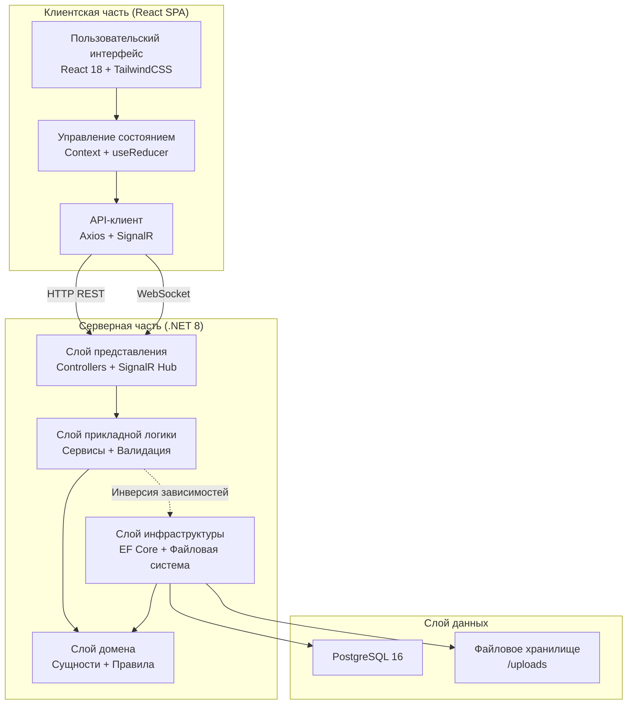
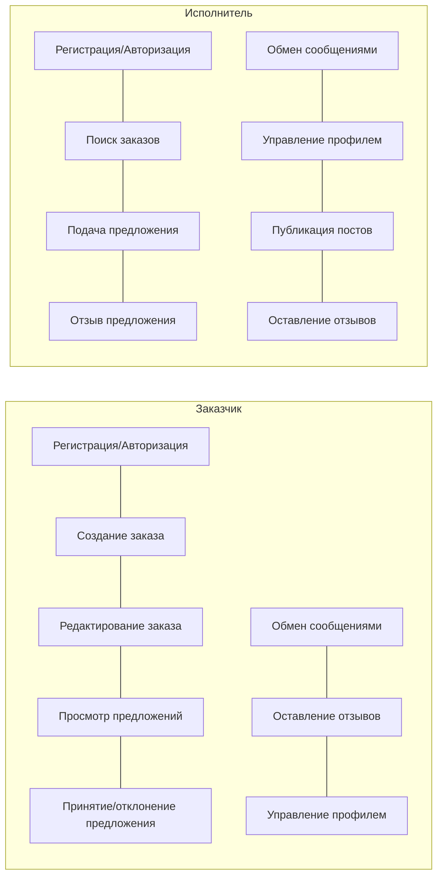
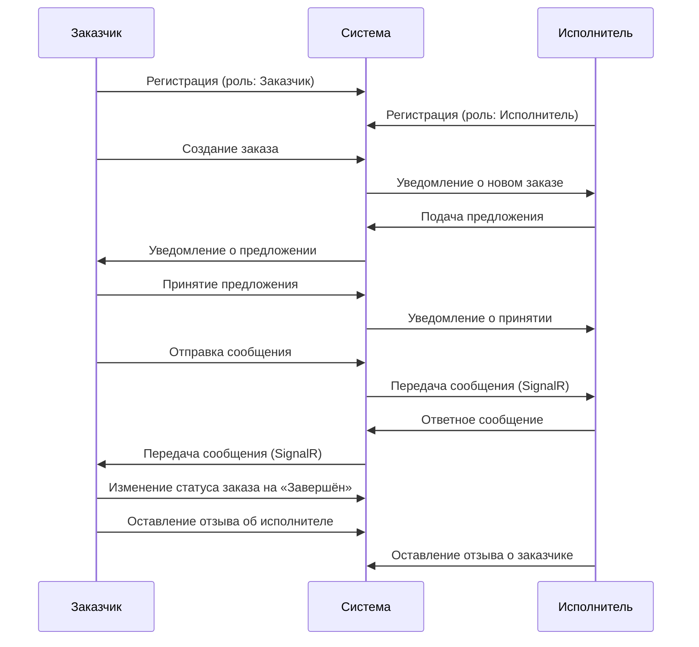
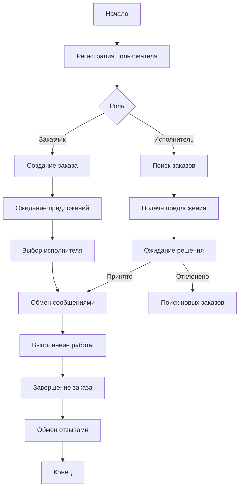
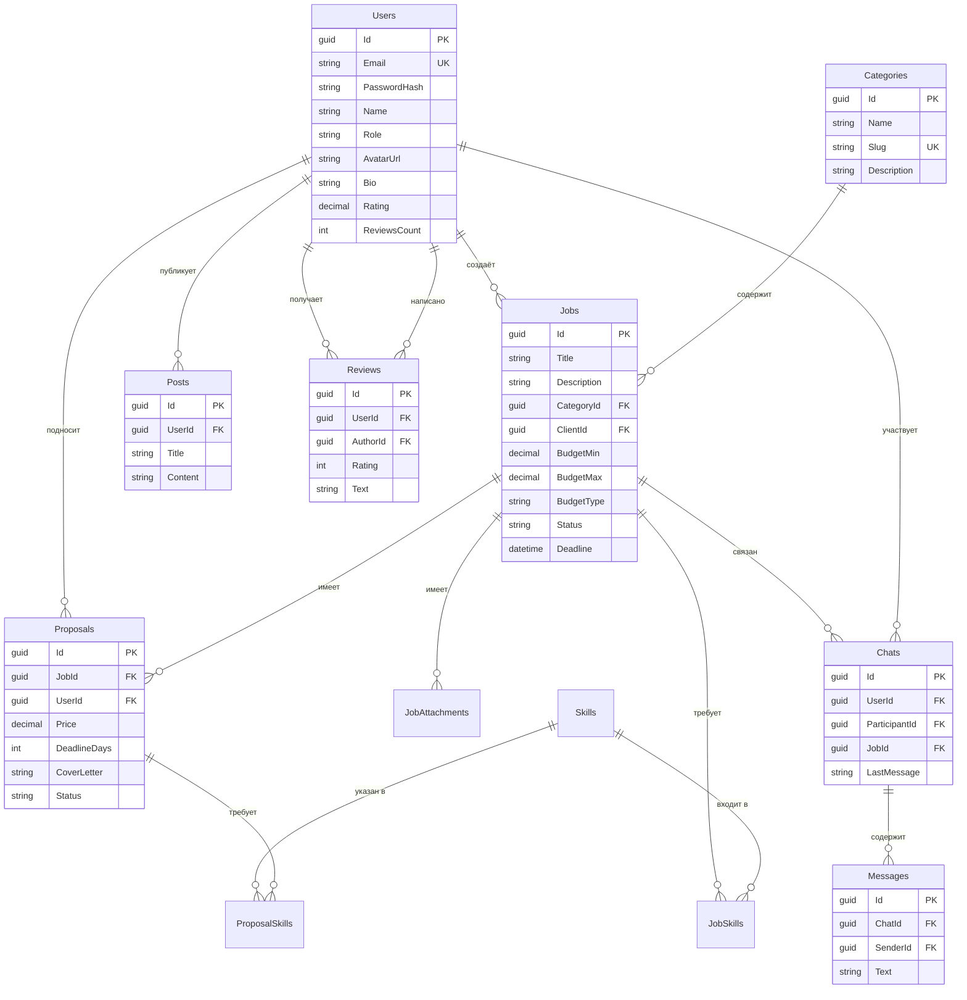

# Пояснительная записка дипломного проекта

# Введение

Развитие цифровой экономики и рост удалённой занятости привели к значительному увеличению спроса на платформы, связывающие заказчиков и исполнителей. По данным исследований, мировой рынок фриланс-платформ к 2028 году достигнет объёма более 12 млрд долларов. В России также наблюдается устойчивый рост числа самозанятых и фрилансеров, что обуславливает актуальность разработки отечественных решений в данной области.

Существующие платформы — такие как Kwork, FL.ru и Хабр Фриланс — обладают рядом ограничений: закрытый исходный код, высокая комиссия, недостаточная адаптация интерфейса под мобильные устройства, отсутствие полноценного real-time общения между участниками. Эти недостатки снижают удобство пользователей и эффективность взаимодействия заказчиков с исполнителями.

Цель дипломного проекта — разработка информационной системы «Synq» — веб-приложения маркетплейса фриланс-услуг, обеспечивающего поиск и размещение заказов, подачу предложений, обмен сообщениями в реальном времени и управление профилями пользователей.

Для достижения поставленной цели определены следующие задачи:

- проанализировать предметную область и существующие аналоги;
- сформулировать функциональные и нефункциональные требования к системе;
- спроектировать архитектуру, модель базы данных и пользовательские интерфейсы;
- реализовать клиентскую часть приложения с использованием React;
- реализовать серверную часть с использованием ASP.NET Core;
- разработать систему real-time обмена сообщениями на основе SignalR;
- обеспечить информационную безопасность приложения;
- провести тестирование разработанного решения.

# 1 Анализ предметной области

## 1.1 Описание предметной области

Предметная область проекта охватывает сферу фриланс-услуг — сегмент экономики, в котором заказчики формируют задания (проекты), а исполнители (фрилансеры) откликаются на них, предлагая свои условия выполнения. Взаимодействие сторон включает подбор исполнителя, согласование условий, обмен сообщениями, контроль выполнения и формирование отзывов.

Основные бизнес-процессы предметной области:

- регистрация пользователей с разделением на роли «Заказчик» и «Исполнитель»;
- создание и публикация заказов (заданий) с указанием категории, бюджета, сроков и требуемых навыков;
- поиск и фильтрация заказов исполнителями по различным критериям;
- подача предложений (откликов) на заказы с указанием цены, сроков и сопроводительного письма;
- обмен сообщениями между заказчиком и исполнителем в реальном времени;
- управление профилем: портфолио, опыт, навыки, часовая ставка;
- формирование отзывов и рейтингов по итогам сотрудничества;
- категоризация заказов по направлениям деятельности.

Структура взаимодействия участников включает две основные роли. Заказчик создаёт заказ, рассматривает предложения, выбирает исполнителя и коммуницирует с ним. Исполнитель ищет заказы, подаёт предложения, выполняет работу и получает отзывы. Система выступает посредником, обеспечивая удобный интерфейс для всех операций.

## 1.2 Обзор аналогов

Для анализа были выбраны следующие существующие решения: Kwork, FL.ru и Хабр Фриланс.

**Kwork** — сервис, ориентированный на оказание услуг по фиксированной цене. Заказчик выбирает услугу из каталога кворков, предложенных исполнителями. Преимущества: простой интерфейс, гарантия безопасности сделок, широкий каталог услуг. Недостатки: формат кворков не позволяет размещать индивидуальные заказы с произвольными условиями; высокая комиссия сервиса (до 20%); ограниченные возможности real-time коммуникации; отсутствие системы рейтингов и отзывов с детализацией по проектам.

**FL.ru** — одна из старейших фриланс-платформ в российском сегменте. Предлагает размещение проектов и конкурсное выбор исполнителя. Преимущества: большая база исполнителей, система портфолио и рейтингов, встроенный сервис «Безопасная сделка». Недостатки: устаревший дизайн интерфейса, отсутствие мобильной адаптации, платная регистрация для исполнителей, отсутствие мгновенного обмена сообщениями (коммуникация через личные сообщения с задержкой).

**Хабр Фриланс** — сервис, интегрированный в экосистему Хабра. Предназначен для IT-специалистов. Преимущества: целевая аудитория IT-проектов, интеграция с профилем Хабра. Недостатки: ограниченная категория проектов (преимущественно IT), отсутствие встроенного мессенджера, ограниченные функции управления заказами.

Анализ выявил следующие пробелы в существующих решениях:

- отсутствие полноценного обмена сообщениями в реальном времени;
- недостаточная адаптивность интерфейсов для мобильных устройств;
- высокие комиссии и ограничения для пользователей;
- отсутствие удобной системы фильтрации и поиска заказов по множеству критериев.

Разрабатываемая система Synq направлена на устранение данных недостатков.

## 1.3 Требования к разрабатываемой ИС

### Функциональные требования

Система должна обеспечивать выполнение следующих функций:

- регистрация и аутентификация пользователей с разделением на роли «Заказчик» и «Исполнитель»;
- создание, редактирование и удаление заказов (заданий) с указанием категории, бюджета, сроков, навыков и вложений;
- просмотр каталога заказов с возможностью поиска по тексту, фильтрации по категории, бюджету и сортировки;
- подача предложений (откликов) на заказы с указанием цены, сроков и сопроводительного письма;
- управление статусами предложений: ожидание, принятие, отклонение, отзыв;
- обмен сообщениями между пользователями в реальном времени (WebSocket);
- создание и управление чатами, привязанными к заказу;
- просмотр и редактирование профиля пользователя: аватар, обложка, биография, навыки, опыт, портфолио;
- публикация постов (статей, кейс-стади) в профиле исполнителя;
- система отзывов и рейтингов;
- управление статусами заказов: открыт, в работе, завершён, отменён;
- просмотр каталога категорий с количеством заказов;
- верификация email-адреса;

### Требования к интерфейсу

Графический интерфейс системы должен отвечать следующим требованиям:

- адаптивный дизайн, обеспечивающий корректное отображение на мобильных устройствах, планшетах и настольных компьютерах;
- минималистичный дизайн с интуитивной навигацией;
- применение стилистики glassmorphism для визуального оформления элементов;
- использование анимаций переходов между страницами для улучшения пользовательского опыта;
- поддержка русского языка во всех элементах интерфейса;
- информативные карточки заказов, предложений и профилей;
- модальные окна для детального просмотра информации;
- уведомления о состоянии операций (успех, ошибка).

## 1.4 Обоснование выбора стека технологий

### Языки программирования

**JavaScript (ES6+)** — выбран в качестве основного языка разработки клиентской части приложения. JavaScript является стандартом де-факто для веб-разработки, обладает широкой экосистемой библиотек и компонентов, поддерживается всеми современными браузерами. Применение современных возможностей ECMAScript (стрелочные функции, деструктуризация, async/await, модули) значительно повышает читаемость и поддерживаемость кода.

**C#** — выбран для серверной части. C# является статически типизированным языком с развитой системой типов, LINQ-запросами и встроенной поддержкой асинхронного программирования. В сочетании с платформой .NET 8 обеспечивает высокую производительность, безопасность типов и эффективную разработку enterprise-уровня [1].

### Фреймворки

**React 18** — выбран для реализации пользовательского интерфейса. React обеспечивает компонентный подход к разработке, виртуальный DOM для эффективного рендеринга, богатую экосистему библиотек и широкое сообщество разработчиков. Версия 18 добавляет поддержку Concurrent Features и автоматическую batching-оптимизацию, что улучшает производительность приложения [2].

**ASP.NET Core 8** — выбран для серверной части. Фреймворк обеспечивает высокую производительность (один из самых быстрых веб-фреймворков по результатам бенчмарков), встроенную поддержку dependency injection, промежуточных обработчиков (middleware) и克里ский кроссплатформенность. Clean Architecture позволяет разделить логику на слои Domain, Application, Infrastructure и WebApi, что обеспечивает тестируемость и поддерживаемость кода [3].

### Система управления базами данных

**PostgreSQL 16** — выбрана в качестве СУБД. PostgreSQL является мощной объектно-реляционной СУБД с открытым исходным кодом, которая поддерживает расширенные типы данных (JSONB, UUID, массивы), полнотекстовый поиск, сложные запросы и транзакции с ACID-гарантиями. По сравнению с MySQL, PostgreSQL предоставляет более строгую систему типов, лучшую поддержку сложных запросов и расширяемость. Выбор PostgreSQL для данного проекта обусловлен необходимостью хранения структурированных данных пользователей, заказов и сообщений, а также требованиями к целостности данных [4].

### Дополнительные технологии

**SignalR** — библиотека реального времени от Microsoft, выбрана для реализации мгновенного обмена сообщениями. SignalR автоматически выбирает оптимальный транспорт (WebSocket, Server-Sent Events, Long Polling) и обеспечивает автоматическое переподключение, что делает взаимодействие надёжным [5].

**Entity Framework Core** — ORM для работы с базой данных, обеспечивающий миграции, LINQ-запросы и отложенную загрузку. Позволяет работать с базой данных через объектно-ориентированную парадигму.

**TailwindCSS** — утилитарный CSS-фреймворк, обеспечивающий быструю разработку интерфейсов за счёт готовых CSS-классов. Позволяет создавать адаптивные интерфейсы без написания кастомного CSS, что ускоряет разработку и поддерживает единообразие стилей [6].

**Vite** — инструмент сборки нового поколения с быстрой горячей перезагрузкой (HMR) и оптимизированной сборкой на основе Rollup. По сравнению с Webpack, Vite обеспечивает значительно более быструю разработку и сборку проекта [7].

**Docker** — платформа контейнеризации, обеспечивающая изолированное и воспроизводимое развёртывание всех компонентов системы. Docker Compose позволяет описать многоконтейнерное приложение в одном файле конфигурации, что упрощает развёртывание и масштабирование [8].

### Обоснование выбора ORM и миграций

Entity Framework Core выбран как ORM, поскольку обеспечивает код-ферст подход (Code First), позволяющий описывать модель данных в виде C#-классов и автоматически генерировать миграции для SQLAlchemy. Это упрощает синхронизацию модели и схемы базы данных, а также позволяет версионировать изменения структуры БД.

# 2 Проектирование

## 2.1 Проектирование системы

Проектирование системы основано на архитектурном паттерне Clean Architecture, который разделяет приложение на концентрические слои с зависимостями, направленными внутрь. Данный паттерн обеспечивает слабую связность компонентов, высокую тестируемость и возможность замены инфраструктурных компонентов без изменения бизнес-логики.

Архитектура системы включает следующие слои:

- **WebApi** — слой представления (контроллеры, SignalR-хабы), обрабатывающий HTTP-запросы и возвращающий данные клиенту;
- **Application** — слой прикладной логики (сервисы, интерфейсы репозиториев, DTO, валидация);
- **Domain** — слой бизнес-логики (сущности, перечисления, правила предметной области);
- **Infrastructure** — слой инфраструктуры (реализация репозиториев через EF Core, работа с файловой системой, отправка email).

Рисунок 2.1 – Архитектура системы Synq

### Определение групп пользователей

Система предусматривает две основные группы пользователей:

**Заказчик (Client)** — пользователь, создающий заказы на выполнение работ. Функции: регистрация и авторизация, создание и редактирование заказов, просмотр предложений исполнителей, принятие или отклонение предложений, обмен сообщениями с исполнителями, оставление отзывов, управление профилем.

**Исполнитель (Freelancer)** — пользователь, выполняющий заказы. Функции: регистрация и авторизация, просмотр каталога заказов с фильтрацией и поиском, подача предложений на заказы, обмен сообщениями с заказчиками, управление профилем (портфолио, навыки, опыт), публикация постов, оставление отзывов.

Рисунок 2.2 – Диаграмма прецедентов (вариантов использования)

### Функциональное моделирование

Разработана архитектура системы на основе модульного подхода. Ключевые модули и их взаимодействие:

**Модуль аутентификации** — обеспечивает регистрацию, вход, выход, верификацию email. Взаимодействует с модулем пользователей через общую сущность User.

**Модуль заказов** — обеспечивает CRUD-операции с заказами, управление статусами, фильтрацию и поиск. Взаимодействует с модулями категорий (для привязки заказа к категории), предложений (для связи заказа с откликами) и пользователей (для связи заказа с автором).

**Модуль предложений** — обеспечивает создание, просмотр, изменение статуса и отзыв предложений. Взаимодействует с модулями заказов и пользователей.

**Модуль сообщений** — обеспечивает создание чатов, отправку и получение сообщений, уведомления о прочтении и набор текста. Реализован на основе SignalR: постоянное соединение с хабом ChatHub обеспечивает мгновенную доставку сообщений и событий, REST API используется для первоначальной загрузки данных.

**Модуль пользователей** — обеспечивает управление профилями, загрузку аватаров и обложек, просмотр профилей исполнителей. Взаимодействует со всеми модулями через сущность User.

**Модуль отзывов** — обеспечивает создание и просмотр отзывов о пользователях с рейтингом.

Рисунок 2.3 – Диаграмма последовательности основного бизнес-процесса

Рисунок 2.4 – Блок-схема основного алгоритма обработки информации

## 2.2 Разработка модели базы данных

Модель базы данных разработана на основе анализа предметной области и включает следующие основные таблицы.

Таблица 2.1 — Структура таблицы Users

| Поле | Тип данных | Описание |
|---|---|---|
| Id | GUID | Первичный ключ |
| Email | VARCHAR(256) | Email-адрес (уникальный) |
| PasswordHash | TEXT | Хеш пароля |
| Name | VARCHAR(128) | Имя пользователя |
| Role | VARCHAR(32) | Роль (Client/Freelancer) |
| AvatarUrl | TEXT | URL аватара |
| CoverUrl | TEXT | URL обложки профиля |
| Bio | TEXT | Биография |
| Location | VARCHAR(256) | Местоположение |
| YearsOfExperience | INTEGER | Опыт работы (лет) |
| HourlyRate | DECIMAL | Почасовая ставка |
| PortfolioUrl | TEXT | URL портфолио |
| IsVerified | BOOLEAN | Email подтверждён |
| Rating | DECIMAL | Средний рейтинг |
| ReviewsCount | INTEGER | Количество отзывов |
| CompletedJobs | INTEGER | Завершённых заказов |
| CreatedAt | TIMESTAMP | Дата создания |

Таблица 2.2 — Структура таблицы Categories

| Поле | Тип данных | Описание |
|---|---|---|
| Id | GUID | Первичный ключ |
| Name | VARCHAR(128) | Название категории |
| Slug | VARCHAR(128) | URL-идентификатор (уникальный) |
| Icon | VARCHAR(64) | Иконка категории |
| Description | TEXT | Описание категории |
| ImageUrl | TEXT | URL изображения |
| Color | VARCHAR(32) | Цвет категории |

Таблица 2.3 — Структура таблицы Jobs

| Поле | Тип данных | Описание |
|---|---|---|
| Id | GUID | Первичный ключ |
| Title | VARCHAR(256) | Название заказа |
| Description | TEXT | Описание заказа |
| CategoryId | GUID | Внешний ключ на Categories |
| BudgetMin | DECIMAL | Минимальный бюджет |
| BudgetMax | DECIMAL | Максимальный бюджет |
| BudgetType | VARCHAR(32) | Тип бюджета (Fixed/Hourly) |
| Deadline | TIMESTAMP | Срок выполнения |
| IsUrgent | BOOLEAN | Срочный заказ |
| Status | VARCHAR(32) | Статус (Open/InProgress/Completed/Cancelled) |
| ClientId | GUID | Внешний ключ на Users (заказчик) |
| CreatedAt | TIMESTAMP | Дата создания |

Таблица 2.4 — Структура таблицы Skills

| Поле | Тип данных | Описание |
|---|---|---|
| Name | VARCHAR(128) | Название навыка (первичный ключ) |

Таблица 2.5 — Структура таблицы JobSkills

| Поле | Тип данных | Описание |
|---|---|---|
| JobId | GUID | Внешний ключ на Jobs (составной PK) |
| SkillName | VARCHAR(128) | Внешний ключ на Skills (составной PK) |

Таблица 2.6 — Структура таблицы Proposals

| Поле | Тип данных | Описание |
|---|---|---|
| Id | GUID | Первичный ключ |
| JobId | GUID | Внешний ключ на Jobs |
| UserId | GUID | Внешний ключ на Users (исполнитель) |
| Price | DECIMAL | Предлагаемая цена |
| DeadlineDays | INTEGER | Срок выполнения (дней) |
| CoverLetter | TEXT | Сопроводительное письмо |
| Status | VARCHAR(32) | Статус (Pending/Accepted/Rejected/Withdrawn) |
| CreatedAt | TIMESTAMP | Дата создания |

Таблица 2.7 — Структура таблицы Chats

| Поле | Тип данных | Описание |
|---|---|---|
| Id | GUID | Первичный ключ |
| UserId | GUID | Внешний ключ на Users (инициатор) |
| ParticipantId | GUID | Внешний ключ на Users (участник) |
| JobId | GUID | Внешний ключ на Jobs (nullable) |
| LastMessage | TEXT | Последнее сообщение |
| LastMessageAt | TIMESTAMP | Время последнего сообщения |
| UnreadCount | INTEGER | Количество непрочитанных |
| IsLeftByUser | BOOLEAN | Покинут инициатором |
| IsLeftByParticipant | BOOLEAN | Покинут участником |
| CreatedAt | TIMESTAMP | Дата создания |

Таблица 2.8 — Структура таблицы Messages

| Поле | Тип данных | Описание |
|---|---|---|
| Id | GUID | Первичный ключ |
| ChatId | GUID | Внешний ключ на Chats |
| SenderId | GUID | Внешний ключ на Users (отправитель) |
| Text | TEXT | Текст сообщения |
| CreatedAt | TIMESTAMP | Дата отправки |

Таблица 2.9 — Структура таблицы Posts

| Поле | Тип данных | Описание |
|---|---|---|
| Id | GUID | Первичный ключ |
| UserId | GUID | Внешний ключ на Users (автор) |
| Title | VARCHAR(256) | Заголовок публикации |
| Content | TEXT | Содержимое публикации |
| LikesCount | INTEGER | Количество лайков |
| CommentsCount | INTEGER | Количество комментариев |
| CreatedAt | TIMESTAMP | Дата создания |

Таблица 2.10 — Структура таблицы Reviews

| Поле | Тип данных | Описание |
|---|---|---|
| Id | GUID | Первичный ключ |
| UserId | GUID | Внешний ключ на Users (получатель) |
| AuthorId | GUID | Внешний ключ на Users (автор) |
| Rating | INTEGER | Рейтинг (1-5) |
| Text | TEXT | Текст отзыва |
| JobId | GUID | Внешний ключ на Jobs (nullable) |
| CreatedAt | TIMESTAMP | Дата создания |

Рисунок 2.5 – Диаграмма базы данных

Связи между таблицами:

- User (1) → (N) Job — один заказчик может иметь несколько заказов;
- User (1) → (N) Proposal — один исполнитель может подать несколько предложений;
- Category (1) → (N) Job — одна категория содержит несколько заказов;
- Job (1) → (N) Proposal — на один заказ может быть подано несколько предложений;
- Job (1) → (N) JobSkill — заказ может требовать несколько навыков;
- User (1) → (N) Chat — пользователь может участвовать в нескольких чатах;
- Chat (1) → (N) Message — чат содержит несколько сообщений;
- User (1) → (N) Review — пользователь может получить несколько отзывов;
- User (1) → (N) Post — исполнитель может иметь несколько публикаций.

## 2.3 Проектирование интерфейсов

Проектирование интерфейсов основано на принципах минимализма, адаптивности и удобства использования. Выбрана стилистика glassmorphism — современный дизайн-подход с полупрозрачными элементами и размытием фона, создающий визуальную глубину и лёгкость интерфейса.

Цветовая палитра: основной цвет — синий (#3b82f6), дополнительные — серый (#6b7280), зелёный (#10b981) для позитивных действий, жёлтый (#f59e0b) для предупреждений, красный (#ef4444) для ошибок. Шрифт — Inter, обеспечивающий хорошую читаемость на различных устройствах.

Основные страницы интерфейса:

- **Главная страница** — герой-секция с поиском, статистика платформы, каталог категорий, избранные заказы, отзывы;
- **Страница авторизации** — табы входа/регистрации с выбором роли;
- **Каталог заказов** — сетка карточек с фильтрацией и поиском;
- **Карточка заказа (модальное окно)** — полная информация о заказе с возможностью подачи предложения;
- **Профиль пользователя** — обложка, аватар, статистика, портфолио, посты, отзывы;
- **Чат** — трёхпанельный интерфейс: список чатов, сообщения, информация о заказе;
- **Создание заказа** — форма с указанием параметров заказа;
- **Мои заказы / Мои предложения** — списки с управлением статусами.

[ЗАМЕСТИТЕЛЬ: здесь необходимо вставить макеты интерфейсов — скриншоты или прототипы страниц приложения]

# 3 Реализация

## 3.1 Реализация основных функций

Реализация клиентской части выполнена в виде SPA (Single Page Application) на базе React 18. Управление состоянием реализовано через Context API и useReducer — единый контекст приложения (AppContext) хранит все данные о пользователе, авторизации и текущем состоянии интерфейса. Доступ к состоянию осуществляется через кастомный хук useAppContext().

Нормализация данных осуществляется через модуль normalize.js, который преобразует ответы сервера в единый формат, принятый на клиенте. Это обеспечивает стабильность структуры данных независимо от изменений на сервере.

Серверная часть реализована по архитектуре Clean Architecture с четырьмя слоями: Domain (сущности, перечисления), Application (сервисы, интерфейсы), Infrastructure (репозитории через EF Core, работа с файлами), WebApi (контроллеры, SignalR-хаб).

```mermaid
classDiagram
    class AuthService {
        +Register(dto) Task~AuthResult~
        +Login(dto) Task~AuthResult~
        +Logout() Task
        +GetCurrentUser() Task~User~
        +VerifyEmail(token) Task
    }

    class JobService {
        +CreateJob(dto) Task~Job~
        +GetJobs(filters) Task~PagedResult~
        +GetJobById(id) Task~Job~
        +UpdateJob(id, dto) Task~Job~
        +DeleteJob(id) Task
        +UpdateJobStatus(id, status) Task
    }

    class ProposalService {
        +CreateProposal(jobId, dto) Task~Proposal~
        +GetProposalsByJob(jobId) Task~List~
        +UpdateProposalStatus(id, status) Task
        +WithdrawProposal(id) Task
    }

    class ChatService {
        +CreateChat(dto) Task~Chat~
        +GetUserChats(userId) Task~List~
        +GetMessages(chatId) Task~PagedResult~
        +SendMessage(chatId, text) Task~Message~
        +MarkAsRead(chatId) Task
    }

    class UserService {
        +GetProfile(id) Task~User~
        +UpdateProfile(id, dto) Task~User~
        +UploadAvatar(id, file) Task
        +GetFreelancers(filters) Task~PagedResult~
    }

    class ReviewService {
        +CreateReview(dto) Task~Review~
        +GetUserReviews(userId) Task~List~
    }

    class CategoryService {
        +GetAll() Task~List~
        +GetBySlug(slug) Task~Category~
    }
```

Рисунок 3.1 – Диаграмма классов основных сервисов приложения

Ключевые реализованные функции:

**Аутентификация и авторизация** — реализована через cookie-аутентификацию ASP.NET Core. При регистрации создаётся пользователь с хешированным паролем (PBKDF2-HMAC-SHA256, 100 000 итераций), устанавливается cookie-токен `synq_session` с продолжительностью 7 дней. На клиенте состояние авторизации хранится в AppContext и localStorage; при загрузке приложения вызывается authApi.me() для проверки текущей сессии.

**CRUD-операции с заказами** — контроллер JobsController обеспечивает создание, просмотр, обновление, удаление и изменение статуса заказов. Доступ к операциям модификации ограничен авторизацией и принадлежностью заказа текущему пользователю.

**Подача и управление предложениями** — исполнители могут подавать предложения с указанием цены, сроков и сопроводительного письма. Заказчики могут принимать или отклонять предложения. Статус предложения может быть: Pending, Accepted, Rejected, Withdrawn.

**Real-time обмен сообщениями** — реализовано через SignalR-хаб ChatHub. На клиенте используется сервис SignalRService, который устанавливает постоянное соединение с хабом через cookie-аутентификацию. При отправке сообщения клиент вызывает метод SendMessage, сервер сохраняет сообщение в БД и рассылает его участникам чата через события ReceiveMessage и MessageSent. Поддерживаются уведомления о наборе текста (Typing), прочтении сообщений (MarkAsRead с визуализацией статуса прочтения — одна/две галочки), а также статусы онлайн/офлайн (UserOnline/UserOffline). При обрыве соединения SignalR автоматически переподключается с нарастающим интервалом (0, 2, 5, 10, 30 секунд) и заново загружает актуальные данные. REST API используется только для первоначальной загрузки списка чатов и истории сообщений.

**Управление профилем** — пользователи могут редактировать данные профиля, загружать аватар и обложку через multipart/form-data запросы, публиковать посты.

## 3.2 Реализация интерфейсов

Реализация интерфейсов выполнена с использованием React 18 и TailwindCSS. Компонентная архитектура разделена на три уровня:

- **Компоненты общего назначения** (src/components/common/) — Button, Input, Card, Badge, Avatar, Modal, ProtectedRoute;
- **Компоненты предметной области** (src/components/features/) — JobCard, JobModal, ProposalCard, ChatMessage, PostCard;
- **Компоненты компоновки** (src/components/layout/) — Header, Footer.

Маршрутизация реализована с помощью React Router DOM v6. Все маршруты, кроме главной страницы и страницы авторизации, защищены компонентом ProtectedRoute, проверяющим состояние аутентификации.

Переходы между страницами реализованы через AnimatePresence (Framer Motion) с режимом wait, что обеспечивает плавные анимации при смене маршрутов.

Адаптивная вёрстка основана на системе breakpoint'ов TailwindCSS (sm: 640px, md: 768px, lg: 1024px, xl: 1280px) и обеспечивает корректное отображение на всех типах устройств. Для карточек заказов используется masonry-раскладка с CSS-колонками.

Взаимодействие с сервером реализовано через Axios-клиент с конфигурацией withCredentials: true для автоматической передачи cookie. Модули API разделены по доменам: auth, jobs, categories, users, proposals, posts, reviews, chats. Все запросы направляются через префикс /api.

Локализация интерфейса выполнена на русском языке. Форматирование дат осуществляется с помощью date-fns с русской локалью, форматирование валют — через Intl.NumberFormat с локалью ru-RU.

## 3.3 Тестирование

Тестирование разработанной информационной системы проводилось методами ручного функционального тестирования, приёмочного тестирования и кроссбраузерного тестирования.

**Функциональное тестирование** проводилось для проверки корректности работы всех функций системы:

- аутентификация: регистрация с различными ролями, вход с валидными и невалидными данными, выход из системы, проверка сохранения сессии при обновлении страницы;
- CRUD-операции: создание, просмотр, редактирование и удаление заказов, подача и отзыв предложений, публикация и удаление постов;
- обмен сообщениями: отправка и получение сообщений в реальном времени, уведомления о наборе текста, пометка сообщений как прочитанных, корректное отображение истории сообщений;
- профиль: редактирование данных, загрузка изображений, просмотр профилей других пользователей.

**Кроссбраузерное тестирование** проводилось в браузерах Google Chrome, Mozilla Firefox и Microsoft Edge. Во всех браузерах обеспечивается корректное отображение интерфейса и функционирование всех компонентов.

**Тестирование адаптивности** проводилось для разрешений экрана: 320px (мобильные), 768px (планшеты), 1024px (ноутбуки), 1440px (настольные мониторы). Все макеты адаптируются корректно, без нарушения структуры.

**Тестирование безопасности** включало:

- проверку доступа к защищённым маршрутам без авторизации — система корректно перенаправляет на страницу авторизации;
- проверку разграничения прав — заказчик не может подать предложение от имени исполнителя и наоборот;
- проверку защиты от XSS — введённые скрипты в текстовые поля не выполняются;
- проверку cookie-аутентификации — HttpOnly-флаг предотвращает доступ к cookie через JavaScript.

Таблица 3.1 – Результаты тестирования основных функций

| Действие | № шага | Описание шага | Ожидаемый результат | Фактический результат |
|---|---|---|---|---|
| Регистрация заказчика | 1 | Открыть страницу авторизации, перейти на вкладку «Регистрация» | Отображается форма регистрации с выбором роли | Форма регистрации отображена корректно |
| | 2 | Ввести имя, email, пароль, выбрать роль «Заказчик», нажать кнопку регистрации | Отправлено письмо для подтверждения email | Письмо отправлено, пользователь создан с ролью Client |
| | 3 | Перейти по ссылке подтверждения в письме | Email верифицирован, выполнен вход в систему | Email подтверждён, cookie установлена |
| Регистрация исполнителя | 1 | Открыть страницу авторизации, перейти на вкладку «Регистрация» | Отображается форма регистрации с выбором роли | Форма регистрации отображена корректно |
| | 2 | Ввести имя, email, пароль, выбрать роль «Исполнитель», нажать кнопку регистрации | Отправлено письмо для подтверждения email | Письмо отправлено, пользователь создан с ролью Freelancer |
| | 3 | Перейти по ссылке подтверждения в письме | Email верифицирован, выполнен вход в систему | Email подтверждён, cookie установлена |
| Авторизация пользователя | 1 | Открыть страницу авторизации, перейти на вкладку «Вход» | Отображается форма входа | Форма входа отображена корректно |
| | 2 | Ввести email и пароль зарегистрированного пользователя, нажать кнопку входа | Установка cookie-токена, редирект на главную страницу | Cookie установлена, редирект выполнен |
| | 3 | Обновить страницу (проверка сохранения сессии) | Сессия сохранена, пользователь остаётся авторизованным | Сессия сохранена, данные пользователя загружены |
| Создание заказа | 1 | Перейти на страницу создания заказа | Отображается форма создания заказа | Форма создания заказа отображена |
| | 2 | Заполнить форму: указать название, описание, категорию, бюджет, сроки, требуемые навыки | Все поля заполнены корректно, валидация пройдена | Данные формы приняты, ошибок валидации нет |
| | 3 | Нажать кнопку создания заказа | Заказ создан и появляется в каталоге | Заказ отображается в каталоге с корректными данными |
| Подача предложения | 1 | Открыть каталог заказов, выбрать заказ и открыть его карточку | Отображается полная информация о заказе | Карточка заказа отображена корректно |
| | 2 | Нажать «Подать предложение», ввести цену, сроки и сопроводительное письмо | Форма предложения заполнена | Данные предложения введены корректно |
| | 3 | Нажать кнопку отправки предложения | Предложение создано со статусом Pending | Предложение отображается в списке, статус Pending |
| Обмен сообщениями | 1 | Открыть раздел чатов, выбрать существующий чат | Отображается история сообщений чата | История сообщений загружена корректно |
| | 2 | Ввести текст сообщения, нажать кнопку отправки | Сообщение отправлено и отображается в чате | Сообщение отправлено через SignalR, отображено у отправителя |
| | 3 | Проверить доставку сообщения собеседнику | Сообщение доставлено собеседнику в реальном времени | Сообщение получено собеседником, статус прочтения обновлён |
| Редактирование профиля | 1 | Перейти на страницу своего профиля | Отображаются текущие данные профиля | Данные профиля загружены корректно |
| | 2 | Изменить данные (биография, навыки, опыт работы), нажать кнопку сохранения | Данные профиля обновлены | Изменения сохранены, отображаются обновлённые данные |
| | 3 | Загрузить аватар и обложку профиля | Изображения загружены и отображаются | Аватар и обложка загружены и отображены корректно |
| Фильтрация и поиск заказов | 1 | Перейти в каталог заказов | Отображается полный список заказов | Каталог заказов загружен корректно |
| | 2 | Выбрать категорию из фильтра, указать диапазон бюджета | Список заказов отфильтрован по категории и бюджету | Отображаются только заказы выбранной категории и диапазона |
| | 3 | Ввести поисковый запрос, применить фильтры | Отображаются только соответствующие заказы | Фильтрация и поиск работают корректно |

# 4 Руководство администратора/пользователя

## 4.1 Руководство пользователя

Для работы с системой Synq пользователь должен иметь доступ к сети Интернет и современный веб-браузер (Google Chrome, Mozilla Firefox, Microsoft Edge последних версий).

**Регистрация.** Для создания аккаунта необходимо перейти на страницу авторизации, выбрать вкладку «Регистрация», указать имя, email, пароль и роль (Заказчик или Исполнитель). После отправки формы на указанный email будет направлено письмо для подтверждения.

**Вход в систему.** На странице авторизации необходимо ввести email и пароль, после чего система выполнит вход и перенаправит на главную страницу.

**Создание заказа (для Заказчиков).** В разделе «Создать заказ» необходимо заполнить форму: название, описание, категория, бюджет (минимальный/максимальный), срок выполнения, срочность, требуемые навыки. После отправки заказ появляется в каталоге.

**Поиск заказов (для Исполнителей).** На странице каталога заказов доступны поиск по тексту, фильтрация по категории, диапазону бюджета и сортировка. Для детального просмотра необходимо нажать на карточку заказа.

**Подача предложения.** На странице заказа необходимо нажать «Подать предложение», указать предлагаемую цену, срок выполнения и сопроводительное письмо.

**Обмен сообщениями.** В разделе «Чаты» доступен список переписок. Выбрав чат, можно обмениваться сообщениями в реальном времени. Система отображает уведомления о наборе текста собеседником и статус прочтения сообщений.

**Управление профилем.** В профиле доступны редактирование данных, загрузка аватара и обложки, добавление информации о себе, навыках, опыте работы и портфолио. Исполнители могут публиковать посты.

## 4.2 Руководство администратора

Для развёртывания системы администратору необходимо выполнить следующие действия:

1. Установить Docker и Docker Compose на сервер;
2. Склонировать репозиторий проекта;
3. Перейти в корневую директорию проекта и выполнить команду `docker-compose up -d`;
4. Дождаться запуска всех контейнеров (PostgreSQL, backend, mailpit, frontend);
5. Убедиться в доступности приложения по адресу http://localhost:3000.

Конфигурация сервисов:

- PostgreSQL: порт 5438, данные хранятся в Docker-томе postgres_data;
- Backend (.NET 8): порт 5000 (HTTP), 5001 (HTTPS), применяет миграции при запуске;
- Frontend (Vite): порт 3000, проксирует запросы к backend;
- Mailpit: порт 8025 (веб-интерфейс), порт 1025 (SMTP), предназначен для тестирования email.

Для мониторинга системы администратор может использовать:

- Swagger UI backend (доступен в режиме разработки);
- Веб-интерфейс Mailpit для просмотра отправленных писем;
- Логи контейнеров Docker.

# 5 Мероприятия по информационной безопасности

## 5.1 Возможные угрозы информационной безопасности

При работе с приложением Synq возможны следующие угрозы информационной безопасности:

- несанкционированный доступ к аккаунту пользователя путём подбора или утечки пароля;
- перехват передаваемых данных (учётные записи, сообщения, личная информация) при передаче по сети;
- межсайтовый скриптинг (XSS) — внедрение вредоносного кода в веб-страницы приложения;
- подделка межсайтовых запросов (CSRF) — выполнение действий от имени авторизованного пользователя без его ведома;
- SQL-инъекции — внедрение вредоносного SQL-кода через входные данные;
- несанкционированный доступ к API-эндпоинтам без авторизации;
- утечка конфиденциальных данных (пароли, личная информация) из базы данных;
- атаки типа DDoS, направленные на нарушение доступности сервиса;
- нарушение целостности данных при concurrent-доступе к заказам и предложениям;
- социальная инженерия — фишинг, манипуляция пользователями.

## 5.2 Принятые меры для предотвращения угроз

### 5.2.1 Разграничение доступа

Модель разграничения доступа в системе Synq основана на ролевой модели (RBAC — Role-Based Access Control). Система предусматривает две роли: «Заказчик» (Client) и «Исполнитель» (Freelancer). Каждая роль определяет набор доступных функций.

Выбор модели RBAC обусловлен простотой реализации и поддержки для приложения с чётко разграниченными ролями. В отличие от моделей MAC (Mandatory Access Control) и ABAC (Attribute-Based Access Control), RBAC не требует сложной конфигурации правил и атрибутов, что делает его оптимальным для маркетплейса фриланс-услуг с двумя основными типами пользователей.

Таблица 5.1 – Матрица разграничения доступа

| Функция | Заказчик | Исполнитель | Неавторизованный |
|---|---|---|---|
| Регистрация и вход | Да | Да | Да |
| Просмотр каталога заказов | Да | Да | Нет |
| Создание заказа | Да | Нет | Нет |
| Редактирование/удаление заказа | Да (своего) | Нет | Нет |
| Подача предложения | Нет | Да | Нет |
| Принятие/отклонение предложения | Да (на свой заказ) | Нет | Нет |
| Обмен сообщениями | Да | Да | Нет |
| Редактирование профиля | Да (своего) | Да (своего) | Нет |
| Публикация постов | Нет | Да | Нет |
| Оставление отзывов | Да | Да | Нет |

Реализация разграничения доступа выполнена на двух уровнях:

- на уровне маршрутов — компонент ProtectedRoute проверяет состояние авторизации и перенаправляет неавторизованных пользователей на страницу входа;
- на уровне API — контроллеры используют атрибут [Authorize] для ограничения доступа к защищённым эндпоинтам, а в методах проверяется принадлежность ресурса текущему пользователю.

### 5.2.2 Безопасная идентификация, аутентификация и авторизация

Процедура идентификации в системе Synq осуществляется по email-адресу пользователя. Каждый пользователь имеет уникальный email, что исключает возможность дублирования аккаунтов.

Аутентификация реализована на основе cookie-аутентификации ASP.NET Core Identity. При регистрации пароль пользователя хешируется с использованием алгоритма PBKDF2-HMAC-SHA256 с 100 000 итераций и 16-байтовой криптографической солью. Выбор PBKDF2 обоснован следующими преимуществами по сравнению с альтернативами:

- PBKDF2 автоматически генерирует криптографическую соль (16 байт) с помощью `RandomNumberGenerator`, что защищает от атак с радужными таблицами. Каждый пароль получает уникальную соль, что делает невозможным использование предварительно вычисленных хешей;
- PBKDF2 использует адаптивное количество итераций (100 000), что делает атаку перебором вычислительно затратной. Увеличение количества итераций прямо пропорционально увеличивает время хеширования, что позволяет масштабировать защиту по мере роста вычислительных мощностей. В отличие от простых хешей (MD5, SHA-256 без итераций), PBKDF2 намеренно замедляет вычисление хеша;
- PBKDF2 реализован средствами встроенной библиотеки `System.Security.Cryptography` платформы .NET, что исключает необходимость подключения сторонних зависимостей и обеспечивает совместимость с платформой;
- для верификации пароля применяется сравнение за постоянное время (`CryptographicOperations.FixedTimeEquals`), что предотвращает атаки по времени (timing-атаки), позволяющие определить правильность части пароля по времени выполнения сравнения;

Cookie-токен `synq_session` создаётся с следующими параметрами безопасности:

- HttpOnly — предотвращает доступ к cookie через JavaScript, что защищает от XSS-атак по краже сессии;
- SameSite=Lax — ограничивает отправку cookie при кросс-сайтовых запросах, что защищает от CSRF-атак;
- SlidingExpiration — продлевает срок действия cookie при активном использовании (7 дней), автоматически завершая неактивные сессии.

Авторизация осуществляется на основе Claims, извлекаемых из cookie: ClaimTypes.NameIdentifier (идентификатор), ClaimTypes.Email (email), ClaimTypes.Name (имя), ClaimTypes.Role (роль). Контроллеры и сервисы проверяют Claims для определения прав доступа текущего пользователя.

Процедура регистрации включает верификацию email-адреса: после регистрации на указанный email отправляется уникальный токен верификации с ограниченным сроком действия. Это предотвращает регистрацию с несуществующими email-адресами и обеспечивает возможность восстановления пароля.

### 5.2.3 Безопасное хранение данных и резервное копирование

Хранение данных пользователей и паролей в системе Synq реализовано с применением следующих мер безопасности:

- пароли хранятся исключительно в хешированном виде (PBKDF2-HMAC-SHA256 с 100 000 итераций), исходные пароли не сохраняются и не могут быть восстановлены;
- конфиденциальные данные (содержание сообщений, личная информация) хранятся в базе данных PostgreSQL с применением шифрования на уровне соединения (SSL/TLS при развёртывании в production);
- файловые данные (аватары, обложки, вложения) хранятся в файловой системе сервера с ограничением доступа на уровне ОС;
- идентификаторы записей используют тип GUID (UUID v4), что предотвращает перебор записей по последовательным идентификаторам;
- при развёртывании в Docker используются переменные окружения для хранения конфиденциальных настроек (строки подключения к БД, секреты), которые не включаются в исходный код.

Выбор PostgreSQL для хранения данных обоснован следующими преимуществами:

- поддержку UUID как нативного типа данных, что упрощает работу с неsequential идентификаторами и повышает безопасность за счёт непредсказуемости ключей;
- поддержку JSONB для гибкого хранения полуструктурированных данных без потери возможностей индексирования;
- встроенную поддержку SSL-соединений, обеспечивающих шифрование данных при передаче между приложением и БД;
- возможность создания полнотекстовых индексов для эффективного поиска по тексту заказов и предложений;
- соответствие требованиям ACID (атомарность, согласованность, изолированность, долговечность), что гарантирует целостность данных при concurrent-доступе.

В сравнении с MySQL, PostgreSQL предлагает более строгую систему типизации, лучшую поддержку сложных запросов и расширяемость, что критически важно для маркетплейса с разнообразными типами данных (пользователи, заказы, чаты, файлы).

Резервное копирование данных реализовано через механизм Docker-томов (postgres_data), который обеспечивает сохранение данных при пересоздании контейнеров. Для production-развёртывания рекомендуются следующие дополнительные меры:

- ежедневное полное резервное копирование базы данных с помощью pg_dump;
- хранение резервных копий на отдельном сервере или в облачном хранилище;
- ротация резервных копий (хранение ежедневных копий за последние 7 дней, еженедельных — за месяц, ежемесячных — за год);
- регулярное тестирование восстановления из резервных копий.

### 5.2.4 Защита кода от неправомерного использования, копирования и взлома

Для данного проекта обфускация кода не проводилась, так как приложение развёртывается на сервере и его исходный код недоступен конечным пользователям. Клиентская часть приложения (JavaScript-бundle) поставляется в минифицированном виде средствами сборщика Vite, что затрудняет чтение и анализ кода, однако не обеспечивает полной защиты от реверс-инжиниринга.

Серверная часть (.NET) компилируется в промежуточный код (IL), который не содержит исходных текстов и не может быть декомпилирован обратно в оригинальный C#-код с сохранением всей структуры и имён. Размещение серверного кода на сервере без публичного доступа к бинарным файлам исключает возможность его несанкционированного копирования.

Дополнительные меры защиты кода включают:

- использование переменных окружения для хранения секретов (строки подключения, ключи) вместо хранения в исходном коде;
- настройку CORS на серверной стороне, ограничивающую запросы к API только с разрешённых доменов;
- закрытый репозиторий исходного кода с ограниченным доступом.

### 5.2.5 Защита авторского права

Для защиты авторских прав в приложении Synq предусмотрен знак защиты авторского права (copyright), размещённый в подвале (Footer) каждой страницы: «© 2025 Synq. Все права защищены.»

Знак содержит все требуемые атрибуты: символ ©, год публикации и наименование правообладателя. Дополнительно в подвале размещена ссылка на условия использования сервиса.

Исходный код проекта защищён лицензией, размещённой в репозитории. Использование материалов проекта без согласия правообладателя не допускается.

## 5.3 Рекомендации пользователям по безопасной работе с приложением

Для обеспечения безопасной работы с приложением Synq пользователям рекомендуется соблюдать следующие правила:

- использовать надёжные пароли длиной не менее 8 символов, содержащие заглавные и строчные буквы, цифры и специальные символы;
- не передавать учётные данные третьим лицам;
- завершать сеанс работы (выход из системы) при использовании общественного или чужого устройства;
- регулярно просматривать активные сессии и завершать подозрительные;
- использовать актуальную версию веб-браузера с включёнными обновлениями безопасности;
- не переходить по подозрительным ссылкам, полученным в сообщениях от незнакомых пользователей;
- при обнаружении подозрительной активности обратиться в службу поддержки.

Дополнительные технологии защиты информации, рекомендуемые при работе с приложением:

- использование VPN-соединения при работе в общественных Wi-Fi-сетях для предотвращения перехвата трафика;
- использование антивирусного программного обеспечения для защиты от вредоносных программ;
- включение межсетевого экрана (firewall) операционной системы для блокировки несанкционированных сетевых подключений;
- использование менеджеров паролей для генерации и хранения уникальных паролей.

# Заключение

В ходе дипломного проекта была разработана информационная система «Synq» — веб-приложение маркетплейса фриланс-услуг, обеспечивающее полный цикл взаимодействия между заказчиками и исполнителями.

В проекте были решены следующие задачи:

- проведён анализ предметной области и существующих аналогов (Kwork, FL.ru, Хабр Фриланс), выявлены их ограничения и определены направления улучшений;
- сформулированы функциональные и нефункциональные требования к системе;
- спроектирована архитектура приложения на основе Clean Architecture с разделением на слои Domain, Application, Infrastructure и WebApi;
- разработана модель базы данных PostgreSQL, включающая 10 основных таблиц с реляционными связями;
- реализована клиентская часть на React 18 с адаптивным интерфейсом в стиле glassmorphism;
- реализована серверная часть на ASP.NET Core 8 с REST API и SignalR для real-time коммуникации;
- реализована система обмена сообщениями в реальном времени на основе SignalR с автоматическим переподключением и доставкой уведлений о прочтении;
- обеспечены мероприятия по информационной безопасности: аутентификация на основе cookie с PBKDF2-хешированием паролей, разграничение доступа по ролям, защита от XSS и CSRF;
- проведено тестирование основных функций системы.

Практическая значимость проекта заключается в создании готового к развёртыванию веб-приложения, которое может быть использовано как основа для запуска фриланс-платформы. Контейнеризация через Docker Compose обеспечивает простое и воспроизводимое развёртывание всей инфраструктуры.

Предложения по совершенствованию программного продукта:

- внедрение системы онлайн-платежей для обеспечения безопасных сделок между заказчиками и исполнителями;
- добавление уведомлений в реальном времени (push-уведомления, email-рассылка) о новых предложениях и сообщениях;
- реализация системы администрирования для модерации контента и управления пользователями;
- внедрение полнотекстового поиска на основе возможностей PostgreSQL с улучшенной релевантностью;
- добавление системы файловых вложений для обмена документами в чатах;
- расширение системы отзывов с возможностью оценки по нескольким критериям;
- оптимизация производительности через кэширование (Redis) и CDN для статических ресурсов;
- внедрение автоматизированного тестирования (unit-тесты, интеграционные тесты, E2E-тесты).

# Список источников

Нормативная документация

1) ГОСТ 34.602-2020 Информационная технология. Комплекс стандартов на автоматизированные системы. Техническое задание на создание автоматизированной системы [Электронный ресурс] — https://protect.gost.ru/document1.aspx?control=31&id=241754

2) ГОСТ 34.201-2020 Информационная технология. Комплекс стандартов на автоматизированные системы. Виды, комплектность и обозначение документов при создании автоматизированных систем [Электронный ресурс] — https://protect.gost.ru/document1.aspx?control=31&id=241756

3) ГОСТ Р ИСО/МЭК 25051-2017 Информационная технология. Системная и программная инженерия. Требования и оценка качества систем и программного обеспечения (SQuaRE). Требования к качеству готового к использованию программного продукта (RUSP) и инструкции по тестированию [Электронный ресурс] — https://protect.gost.ru/document.aspx?control=7&id=217667

4) ГОСТ 19.106-78 Единая система программной документации. Требования к программным документам, выполненным печатным способом [Электронный ресурс] — https://protect.gost.ru/document.aspx?control=7&id=156370

5) ГОСТ 19.401-78 Единая система программной документации. Текст программы. Требования к содержанию и оформлению [Электронный ресурс] — https://protect.gost.ru/document.aspx?control=7&id=155463

6) ГОСТ Р 2.105-2019 Единая система конструкторской документации. Общие требования к текстовым документам [Электронный ресурс] — https://protect.gost.ru/document1.aspx?control=31&baseC=6&page=0&month=1&year=2025&search=%D0%93%D0%9E%D0%A1%D0%A2%20%D0%A0%202.105-2019&id=237857

Интернет-ресурсы

7) Документация React [Электронный ресурс] — https://react.dev

8) Документация ASP.NET Core [Электронный ресурс] — https://learn.microsoft.com/ru-ru/aspnet/core

9) Документация PostgreSQL [Электронный ресурс] — https://www.postgresql.org/docs

10) Документация SignalR [Электронный ресурс] — https://learn.microsoft.com/ru-ru/aspnet/core/signalr

11) Документация TailwindCSS [Электронный ресурс] — https://tailwindcss.com/docs

12) Документация Vite [Электронный ресурс] — https://vitejs.dev

13) Документация Docker [Электронный ресурс] — https://docs.docker.com

14) Документация Entity Framework Core [Электронный ресурс] — https://learn.microsoft.com/ru-ru/ef/core

15) Документация System.Security.Cryptography [Электронный ресурс] — https://learn.microsoft.com/ru-ru/dotnet/api/system.security.cryptography

# Приложение А

Листинг модуля аутентификации (AuthController.cs)

[ЗАМЕСТИТЕЛЬ: здесь необходимо вставить листинг кода модуля аутентификации из backend/src/Synq.WebApi/Controllers/AuthController.cs]

Листинг модуля управления состоянием (AppContext.jsx)

[ЗАМЕСТИТЕЛЬ: здесь необходимо вставить листинг кода модуля управления состоянием из src/store/index.jsx]

Листинг модуля SignalR (signalr.js)

[ЗАМЕСТИТЕЛЬ: здесь необходимо вставить листинг кода модуля SignalR из src/api/signalr.js]